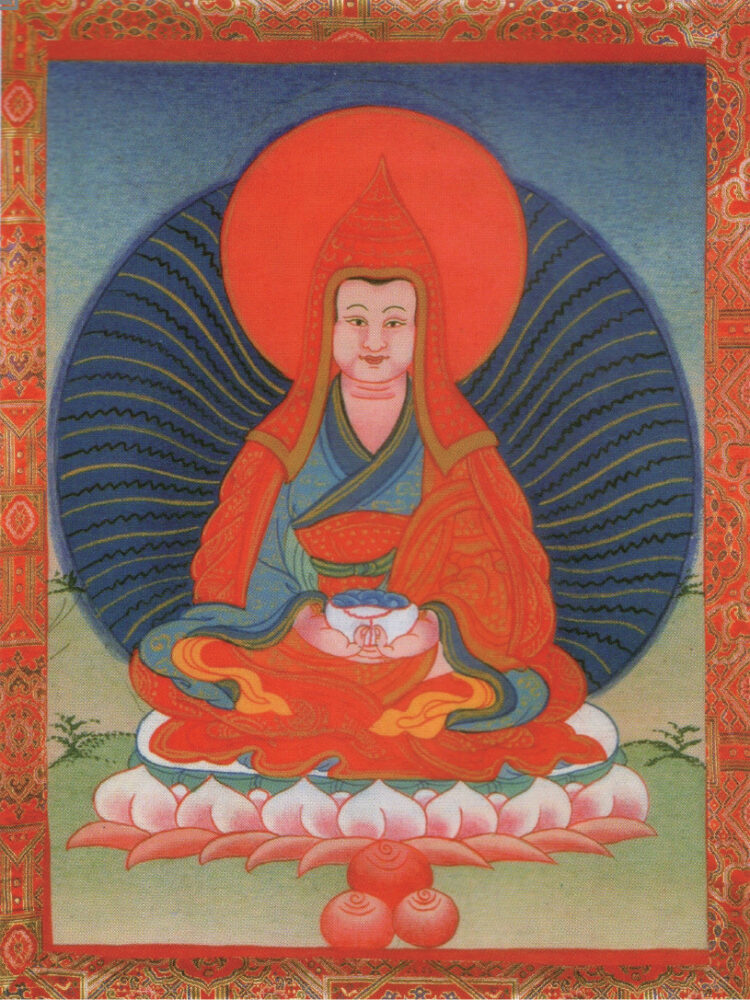
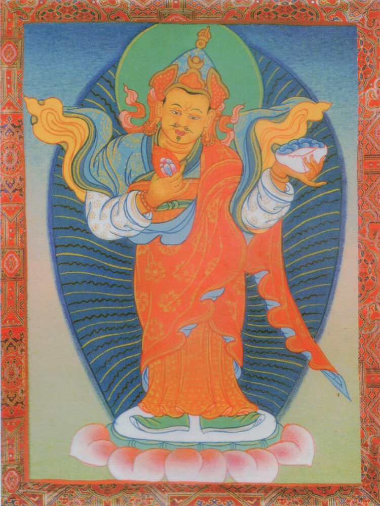

<!-- backgroundImage: "linear-gradient(to bottom, #ffcad2, #6de1ff)" -->

意愿任运成就祈祷文

---

## 主尊:贝玛桑巴瓦 (1)

哎玛吙！ `哎玛吙！`
呢效得瓦坚杰样康色 `西方极乐刹土中`  
囊瓦塔耶特吉辛拉御 `阿弥陀兴悲加持`
哲格巴玛炯内辛拉得 `加持化身莲花生`
瞻威朗德卓沃敦拉迅 `为利有情临瞻洲`
卓敦锦恰美波特杰坚 `无间利生大悲尊`
哦坚巴玛炯内拉所瓦得 `祈祷邬金莲花生`
三巴楞基哲巴辛基洛 `加持意愿任运成`

---

## 主尊:贝玛桑巴瓦 (2)

嘉波赤仲德赞曼恰内 `始自赤松德赞王`
秋嘉洞杰塔拉玛东瓦 `乃至王嗣未尽间`
迪僧锦恰美巴辛基洛 `三时恒常赐加持`
沃杰秋炯嘉布您结波 `护法藏王唯一怙`
嘉波秋效炯沃特杰坚 `护王法行大悲尊`
哦坚巴玛炯内拉所瓦得 `祈祷邬金莲花生`
三巴楞基哲巴辛基洛 `加持意愿任运成`

---

## 主尊:贝玛桑巴瓦 (3)

格呢洛呢震布卡伦匝 `身镇西南罗刹众`
特吉沃杰森坚永拉惹 `悲观藏地诸有情`
玛热洛波森坚珍波华 `无明邪众引导师`
纽蒙德革森坚塔基德 `巧化难调烦恼众`
贼洞锦恰美波特杰坚 `慈悯无间大悲尊`
哦坚巴玛炯内拉所瓦得 `祈祷邬金莲花生`
三巴楞基哲巴辛基洛 `加持意愿任运成`

---

## 主尊:贝玛桑巴瓦 (4)

迪安涅咪塔拉特波才 `五浊恶世之末际`
囊热恭热沃杰敦拉迅 `朝夕降临利藏土`
涅热恰德当拉结得迅 `乘御晨曦及落晖`
雅欧材吉迪色乌色迅 `上弦初十亲驾临`
卓敦多钦匝波特杰坚 `大力利生大悲尊`
哦坚巴玛炯内拉所瓦得 `祈祷邬金莲花生`
三巴楞基哲巴辛基洛 `加持意愿任运成`

---

## 主尊:贝玛桑巴瓦 (5)

锕吉塔玛作迪涅玛拉 `五百年末浊诤世`
森坚坛加纽蒙德锕 Ra `诸有情惑五毒粗`
纽蒙窍袅德锕让杰效 `罹受自相惑乱毒`
得辄迪纳切辄特吉交 `尔时唯汝大悲救`
达丹托瑞珍波特杰坚 `悲引具信至善趣`
哦坚巴玛炯内拉所瓦得 `祈祷邬金莲花生`
三巴楞基哲巴辛基洛 `加持意愿任运成`

---

## 1.莲师忿怒尊 ﹝上师退敌胜尊﹞

霍所结波玛给塔果内 `可怖霍等军围困`
秋括年波结拉特波才 `尊圣法轮濒毁时`
宜尼泰聪美巴所瓦得 `意无疑虑诚祈祷`
哦坚拉震得嘉括当吉 `莲师天龙八部俱`
霍所玛宏舵巴泰聪美 `逐退霍等军无疑`
哦坚巴玛炯内拉所瓦得 `祈祷邬金莲花生`
三巴楞基哲巴辛基洛 `加持意愿任运成`

---

## 2.莲师药师佛 ﹝上师大医王﹞

森坚杰利结波纳雄才 `有情幻躯坏病时`
么若德锕纳基碾巴纳 `遭受难忍病苦迫`
宜尼泰聪美巴所瓦得 `意无疑虑诚祈祷`
哦坚曼杰喇当耶美贝 `莲师药师佛无别`
才 Ra 玛银瓦恰诶巴色 `定除非时横死障`
哦坚巴玛炯内拉所瓦得 `祈祷邬金莲花生`
三巴楞基哲巴辛基洛 `加持意愿任运成`

---

## 3.莲师财神 ﹝上师大自在财神﹞

炯瓦札朗萨借年波才 `大种起灾地精衰`
森坚么给纳基碾巴纳 `有情遭受饥病时`
宜尼泰聪美巴所瓦得 `意无疑虑诚祈祷`
哦坚宽卓诺勒措当吉 `莲师空行财神俱`
沃彭这贡色瓦泰聪美 `贫乏饥渴除无疑`
哦坚巴玛炯内拉所瓦得 `祈祷邬金莲花生`
三巴楞基哲巴辛基洛 `加持意愿任运成`

---

## 4.莲师开取岩藏 ﹝上师众中尊﹞

类坚卓沃敦德得敦纳 `具缘者为众启藏`
丹策若若美波华当给 `以无虚诳誓言力`
宜尼泰聪美巴所瓦得 `意无疑虑诚祈祷`
哦坚宜丹拉当耶美贝 `莲师本尊无别故`
帕诺沃义论巴泰聪美 `子享父财定无疑`
哦坚巴玛炯内拉所瓦得 `祈祷邬金莲花生`
三巴楞基哲巴辛基洛 `加持意愿任运成`

---

## 5.莲师除秘地障 ﹝上师圆满导引尊﹞

未耶纳绰问萨袅波才 `奔波幽僻林野时`
卡恰沃耶策向蓝嘎纳 `暴风雨雪路阻绝`
宜尼泰聪美巴所瓦得 `意无疑虑诚祈祷`
哦坚耶达年布括当吉 `莲师威猛地神俱`
秋匝蓝纳珍巴泰聪美 `引领行者道无疑`
哦坚巴玛炯内拉所瓦得 `祈祷邬金莲花生`
三巴楞基哲巴辛基洛 `加持意愿任运成`

---

## 6.莲师解猛兽难 ﹝上师护法王﹞

达惹洞这德遮切瓦坚 `虎豹熊罴毒蛇象`
拙钦结波创拉贞波才 `旷野险道猝相逢`
宜尼泰聪美巴所瓦得 `意无疑虑诚祈祷`
哦坚华卧刚当忠玛吉 `莲师勇刚护法俱`
德波森坚酌巴泰聪美 `驱散恶有情无疑`
哦坚巴玛炯内拉所瓦得 `祈祷邬金莲花生`
三巴楞基哲巴辛基洛 `加持意愿任运成`

---

## 7.莲师除四大障 ﹝上师虚空尊﹞

萨且美龙炯沃瓦恰基 `地水火风灾障起`
杰利碾匠结波迪雄才 `幻躯受害濒危时`
宜尼泰聪美巴所瓦得 `意无疑虑诚祈祷`
哦坚炯瓦耶宜拉姆吉 `莲师四大天女俱`
炯瓦让萨耶瓦泰聪美 `大种当下调无疑`
哦坚巴玛炯内拉所瓦得 `祈祷邬金莲花生`
三巴楞基哲巴辛基洛 `加持意愿任运成`

---

## 8.莲师除牢狱厄 ﹝上师解凶暴缚﹞

蓝创结波创拉贞波才 `经行怖畏险道时`
萨切加巴琼布碾巴纳 `若遇盗贼劫杀侵`
宜尼泰聪美巴所瓦得 `意无疑虑诚祈祷`
哦坚夏嘉耶宜恭巴丹 `莲师具四印密意`
作 Ra 么果昂森拉巴学 `摧坏歹徒贪毒心`
哦坚巴玛炯内拉所瓦得 `祈祷邬金莲花生`
三巴楞基哲巴辛基洛 `加持意愿任运成`

---

## 9.莲师解杀戮厄 ﹝上师金刚铠甲﹞

刚耶协咪玛给塔果内 `若为刑吏所环伺`
存恰伦布得向碾巴纳 `执持利刃加害时`
宜尼泰聪美巴所瓦得 `意无疑虑诚祈祷`
哦坚多吉各当丹巴义 `莲师金刚帐幔护`
协玛这匠存恰托瓦杰 `刑吏惊退兵刃折`
哦坚巴玛炯内拉所瓦得 `祈祷邬金莲花生`
三巴楞基哲巴辛基洛 `加持意愿任运成`

---

## 10.莲师引度极乐 ﹝上师遮死时苦﹞

南耶才 Ra 且沃迪雄才 `若适寿尽濒死时`
纳皎德锕札布碾巴纳 `身遭分解剧苦迫`
宜尼泰聪美巴所瓦得 `意无疑虑诚祈祷`
哦坚囊瓦塔耶哲巴得 `莲师阿弥陀化身`
得瓦坚杰样德诶巴洁 `定令往生极乐刹`
哦坚巴玛炯内拉所瓦得 `祈祷邬金莲花生`
三巴楞基哲巴辛基洛 `加持意愿任运成`

---

## 11.莲师救中有险 ﹝上师中有解脱﹞

杰利雅波耶波瓦多热 `假幻躯坏至中有`
彻囊酿彻德锕碾巴纳 `迷中迷现苦逼时`
宜尼泰聪美巴所瓦得 `意无疑虑诚祈祷`
哦坚迪僧钦波特杰义 `莲师知三世大悲`
彻囊让萨卓瓦泰聪美 `迷现当下超无疑`
哦坚巴玛炯内拉所瓦得 `祈祷邬金莲花生`
三巴楞基哲巴辛基洛 `加持意愿任运成`

---

## 12.莲师解脱轮回 ﹝上师断轮回苦﹞

沿扬类当锦杰旺杰得 `复由业缘所导致`
彻囊乌波印匠德锕纳 `迷现执实生苦恼`
宜尼泰聪美巴所瓦得 `意无疑虑诚祈祷`
哦坚得钦嘉布欧卧得 `莲师大乐王体性`
德锕彻瓦匝内耶巴学 `痛苦迷乱令根除`
哦坚巴玛炯内拉所瓦得 `祈祷邬金莲花生`
三巴楞基哲巴辛基洛 `加持意愿任运成`

---

## 13.莲师大乐 ﹝上师六道依怙尊﹞

卓哲德锕钦布碾巴当 `六道轮回剧苦迫`
恰巴沃杰杰棒德锕纳 `尤其藏地君民苦`
达给木波洞协札波义 `若以猛厉敬信心`
宜尼泰聪美巴所瓦得 `意无疑虑诚祈祷`
哦坚特吉颇杰美巴惹 `莲师不变悲观照`
哦坚巴玛炯内拉所瓦得 `祈祷邬金莲花生`
三巴楞基哲巴辛基洛 `加持意愿任运成`
