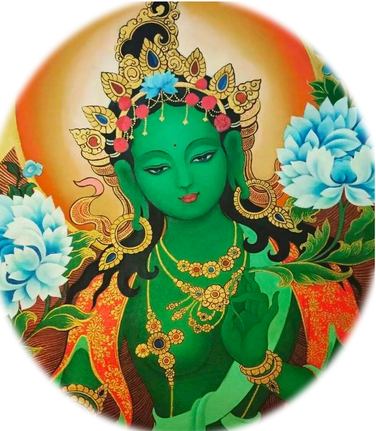
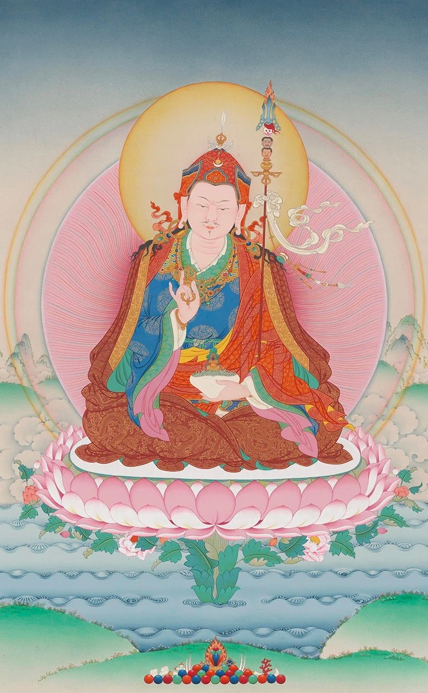
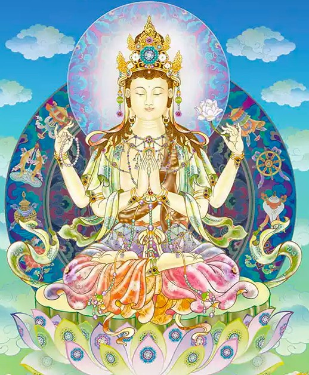
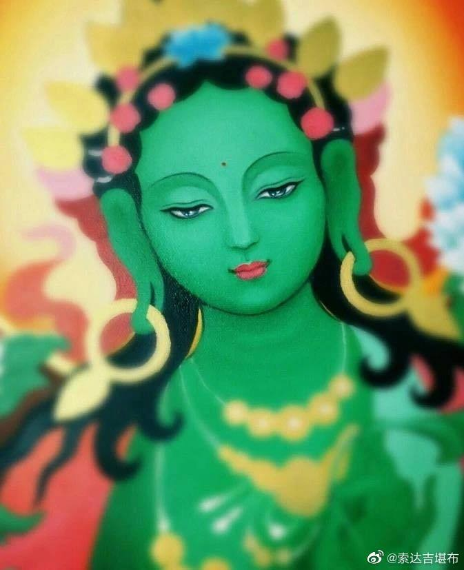

### 加倍咒（三遍）

# 嗡 桑巴Ra 桑巴Ra 
# 波玛纳 萨Ra 玛哈 臧巴巴 吽啪德 娑哈

---

# 圣八吉祥颂

**嗡** 嗡

**囊哲南达让银楞哲波**  现有清净自性任运成

**札西效吉样纳犹巴耶**  如是十方吉祥刹土中

**桑吉秋当根登帕波措**  所住诸佛正法圣僧众

**根拉香擦达加札西效**  悉皆顶礼愿我等吉祥

### 

**准昧嘉波匝丹敦哲恭**  灯王佛及贤勇义成佛

**宣波坚华给札华丹巴**  慈严德佛善名胜德佛

**根拉恭巴嘉切札巴坚**  一切义持广大名称佛

**楞波达帕匝札华当呢**  如须弥山圣力名德佛

---

**森坚坛加拉恭札波华**  垂念一切有情名德佛

**耶层匝巴匝Ra札华得**  遂愿威力名称吉祥佛

**灿赞图贝札西华培瓦**  仅闻名号增上吉祥德

**得瓦夏巴嘉拉香擦洛**  八大善逝尊前敬顶礼

### 

**蒋华云呢华丹多杰怎**  文殊童子具德金刚手

**宣瑞惹旺衮波宣波华**  圣观自在怙主慈氏尊

**萨耶酿波哲巴南巴色**  地藏菩萨以及除盖障

**南葵酿波帕窍根德让**  虚空藏与胜圣普贤尊

---

**额巴多杰巴嘎勒向当**  青莲金刚白莲那伽树

**诺沃达瓦Ra哲涅玛耶**  如意宝珠宝剑日月轮

**夏灿拉南札西华杰窍**  善持标帜吉祥殊胜德

**香且森华嘉拉香擦洛**  八大菩萨尊前敬顶礼

###

**仁钦德窍札西色杰Ni**a  殊胜宝伞吉祥黄金鱼

**多炯翁让耶嗡嘎玛拉**  如意宝瓶悦意妙莲花

**年札东当彭措华威额**  悦音海螺圆满吉祥结

**么呢江灿旺杰括洛得**  不朽胜幢自在金轮宝

---

**仁钦达窍嘉杰夏灿坚**  持八殊胜珍宝之标帜

**效迪嘉瓦窍匠基洁玛**  供养十方三世佛生喜

**嘎所噢卧展贝华贝沃**  嬉女等尊唯念增吉祥

**札西拉姆嘉拉香擦洛**  八大吉祥天女敬顶礼

###

**苍巴钦波登炯这美沃**  大梵大自在天遍入天

**么东丹当嘉波耶括忠**  千目帝释与持国天王

**帕基波当勒旺么么让**  增长天王龙王广目天

**南图这得拉贼括洛当**  多闻天王各持天宝物

---

**哲协拉当东通多杰坚**  轮三叉戟短枪金刚杵

**波旺Ra哲窍定江灿怎**  琵琶宝剑宝塔胜宝幢

**萨僧内色给拉札西贝**  三界增上善妙与吉祥

**结定炯瓦嘉拉香擦洛**  八大世间护法敬顶礼

### 

**达加当德夏瓦纵巴拉**  我等如今所作诸事业

**嘎当涅瓦才瓦根耶内**  一切魔障恼害悉消泯

**多敦华培三敦耶银哲**  顺缘增长所愿如意成

**札西得拉彭森措巴效**  祈愿吉祥如意悉圆满

---

## 怀业祈祷文·大加持云

### 

嗡阿吽舍  嗡阿吽舍

###

**得钦巴瓦旺格颇庄德**  大乐炽燃怀柔宫殿中

**得东所所多波耶希格**  乐空圣妙观察智慧身

**玛恰得丹巴咪让银类**  离欲具乐莲花自性中

**多杰涅玛囊瓦钦布华**  金刚日大光明之胜德

---

**秋格囊瓦塔耶多杰秋**  法身无量光佛金刚法

**结定旺秀特杰吉恰惹**  世间自在大悲为怀身

**巴玛嘉波括迪锕旺杰**  驾御轮回涅槃莲花王

**囊哲惹伦旺钦嘿热嘎**  胜伏现有雄威嘿热嘎

**桑瓦耶希班匝哇Ra合**  秘密智母金刚亥母尊

**得窍多波嘉波得钦得**  胜乐欲王以及大乐藏

**玛利洁给耶绰热学玛**  怀摄一切众心作种母

**窍腾夏吉旺秀得东嘎**  胜共手印自在乐空舞

**旺匝多杰华卧札给措**  怀柔金刚勇士空行聚

**囊东年巴钦布昂涅德**  现空广大平等自性中

**多杰格耶嘎基哲僧哟**  金刚身之游舞撼三有

**嘎美颂格压这康僧各**  无碍语之笑声召三界

---

**奥热玛布括迪永拉恰**  红光周遍轮涅一切处

**哲伊当借哟样德巴学**  撼动聚集有寂诸精华

**多杰恰巴钦布特基呢**  依于金刚大贪之意乐

**南尼乌哲多给窍作样**  赐予所欲二种胜悉地

**多杰加杰压巴钦波义**  施以金刚铁钩大绢索

**囊哲得瓦钦波洞学巴**  现有诸法摄于大乐中

**塔耶杰彻札沃若嘎坚**  无边幻化网中游舞者

**德杰恭沃学瓦银犹波**  犹如芝麻荚开而安住

**冉绛匝僧旺格拉措拉**  怀柔圣众浩瀚三根本

**给贝所瓦得所辛基洛**  至诚恭敬祈祷垂加持

**窍腾乌哲多给华塔达**  一切所欲胜共诸悉地

**托美旺德学波乌哲作**  无碍怀业成就祈垂赐

---

## 莲师心咒

###

# 嗡阿吽
# 班匝儿格热巴玛色德吽

---

## 观音心咒

# 嗡嘛呢巴美吽

---

## 度母心咒

# 嗡 达热 德达热 德热 娑哈