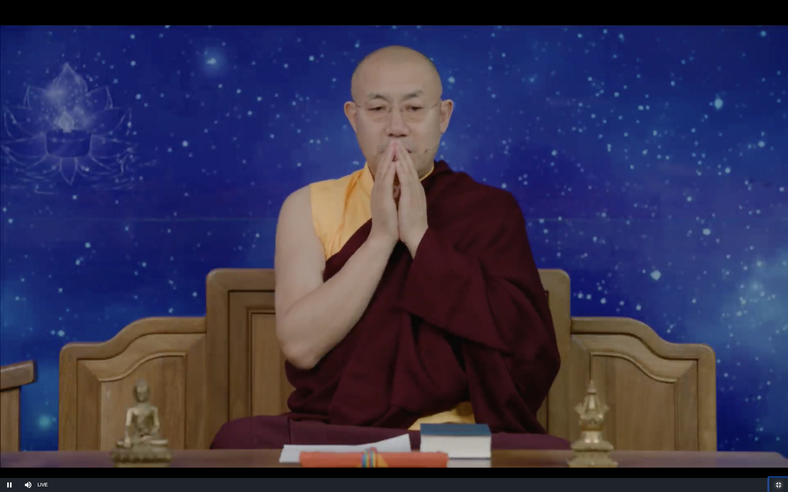
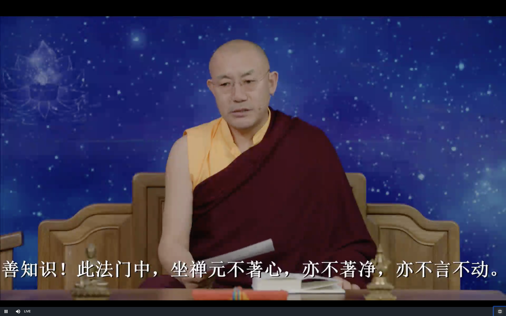
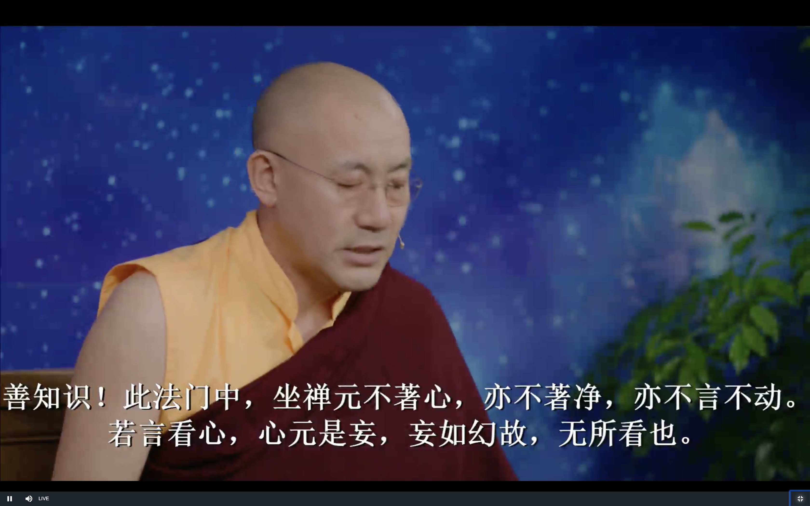
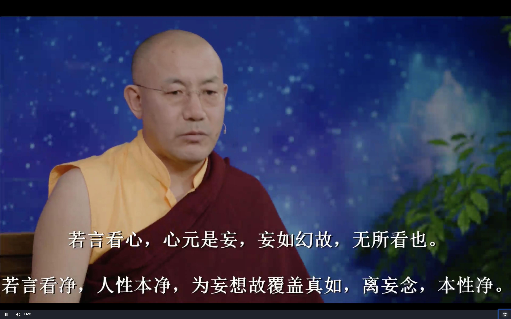
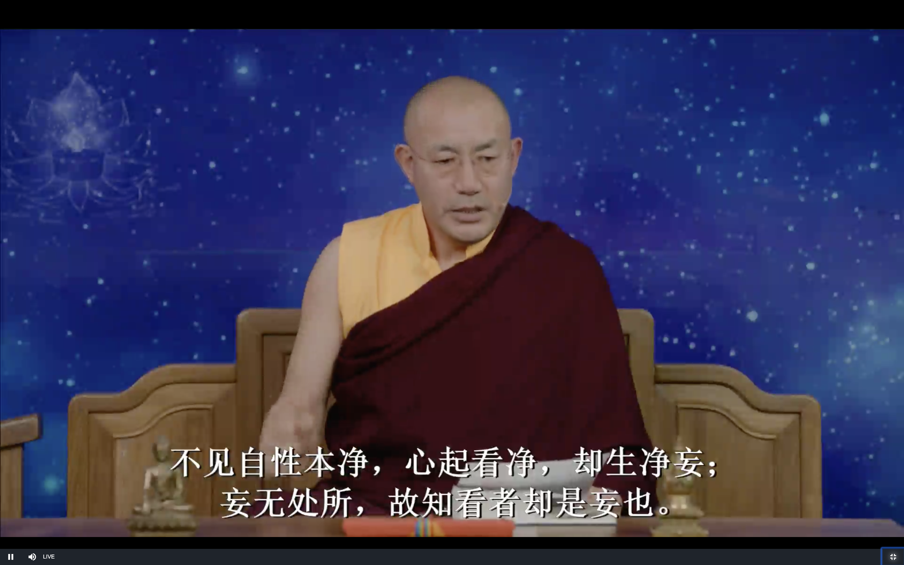
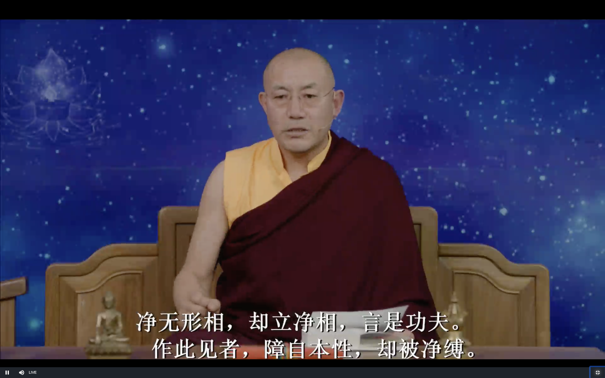
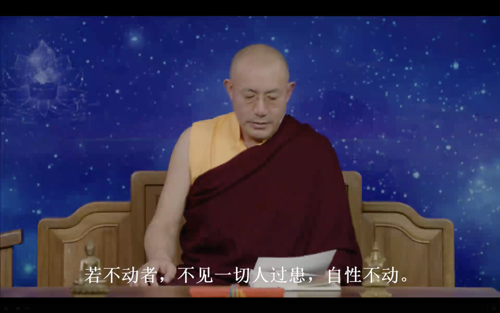
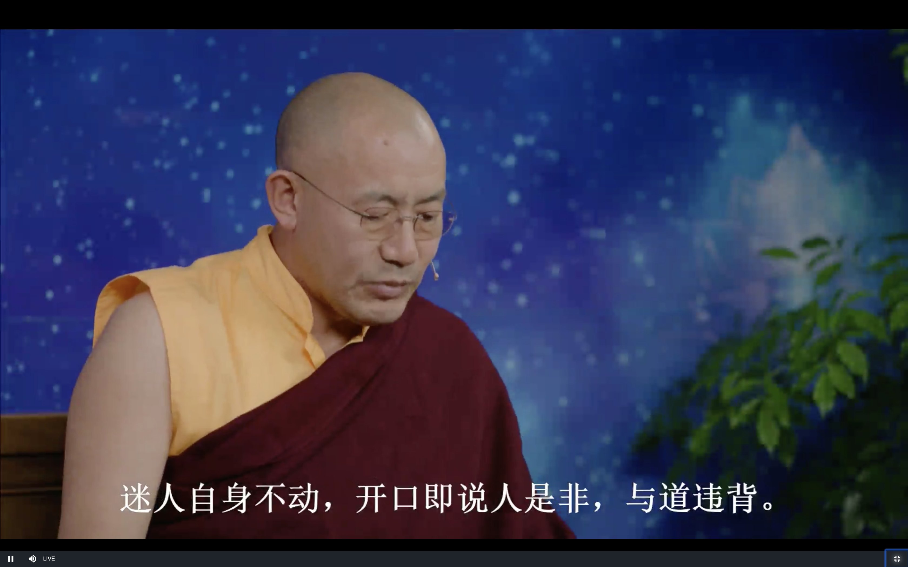
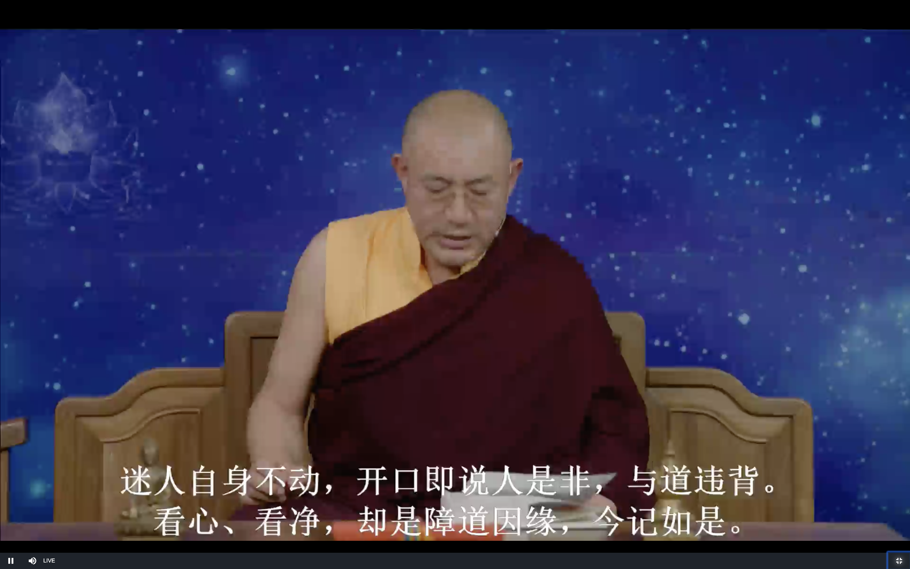

# 坛经 坐禅品

上师10月20日开示

# 发菩提心

做任何善事一定要发菩提心 这个特别重要

只要努力 就一定会有的 世俗的事情是这样 学佛也是一样的

### 自利利他

首要的目标是利他 利他的前提条件就是要利己 当通过学习有了智慧 慈悲心 能力之后 才能真正利他

所以要从利己入手

为了让一切众生离苦得乐 我们要发誓成佛 这就是菩提心了

# 六祖坛经坐禅品

下面继续讲六祖坛经

前面讲了 智慧品 定慧品 今天讲第五品 坐禅品

坛经的意义非常深奥 非常殊胜 那怎么去用呢 坐禅品里就是讲的具体的修法

整个坛经十品中 今天讲的坐禅品是非常的重要 大家一定要珍惜

但是如果没有修四加行 五加行 直接修这坐禅品的修法的话 也是没有什么意义的

**善知识 此法门中 坐禅元不著心 亦不着净 亦不言不动。**

善知识 指的是慧能大师的弟子们

此法门 有别于汉传 显宗的其他法门 禅宗是很特别的

这几句话特别重要 

敦煌版有五个版本 有个版本是这样:

> 坐禅不看心 不看净 亦不言动

这个版本少了一个"不"字 为什么说这个版本少了一个字呢 后面解释的时候有讲"若不动者" 有"不动" 所以应该是少了一个"不"字

"不看心" 也是对的 后面有 "若言看净" 所以用"看" 应该也是可以的

### 不著心

**不著心** 不执著心 这个是对的 比较容易理解

如果说"不看心" 这个就有点不好理解一点

实际上 "看心" 和 "著心" 对于我们没有证悟的人来说 都是一样的  我们没有证悟的人的看心 都有执著的成分

比如说我们当有"桌子"这样的念头冒出来的时候 我们就会认为是"实有的桌子"

没有证悟的人来说 去看心 其实就是把它当做是实有的 因为我们的心中没有证悟空性的智慧 所有的念头 都是带有真实的成分在内

很多关于坛经的大学教授等的论文 写的都很不错的 但是他们不会告诉我们"看"和"著"意义的区别

但是我们修行是非常重要的

**元不著心** **元** 本来就是 证悟的人进入禅定的时候 本来就是不著心的

### 不著净

**亦不著净** 清净这个词 在三转法轮的时候讲的特别多 这里又否定了 不能执著净 不要强调清净 就是不要给心的本性贴标签 贴标签这样子就不对了

佛性 我们的本性 是远离所有的这些标签 语言所能够表达的东西 所以这里说要"不著净"

### 不著不动

**亦不言不动** 否定世俗的禅定 即四禅八定 前边已经讲过了不止十次了 就是心平静的禅定 百无不思 念头归零 这种禅修在世俗的禅修中是没有错的

禅宗的禅定的层次和 大圆满 大手印是差不多的

世间的禅定修的再好也是停留在阿赖耶识的层面 (从解脱的角度来讲)也是没有用的 阿赖耶识就是属于我们心的范畴 阿赖耶识是第八识 心是八识的总称

最高的四禅八定 无色界的禅定 没有一丝杂念 但是就是缺了一点点智慧 禅宗就是不鼓励修这样的禅定

### 两种不同的看心

**若言看心 心元是妄 妄如幻故 无所看也**

这里就开始用"看" 都是一样的

**妄** 妄念 狂妄 执著 

**心** 就是八识 眼耳鼻舌身意 末那识 阿赖耶识

心就是虚假的 妄念 虚假的看了有什么用呢

这里不是说去看念头的本质 跟前几节课里讲的不一样 

心表面的现象是贪嗔痴 烦恼 这里讲的是不要看心表面的现象 不是说不要看心的本质

看心是一个过程 刚开始就是看表面的意识 

最后要看的是里面的佛性 就像提炼出矿石里的精华 

看心的本质有两种方法 一种就是像六祖慧能一样 言下大悟 就像乌云漫天的时候 大风一下子就把乌云都吹走了 现出了蓝天

另一种就是藏传佛教的方法 四加行 五加行 积累资粮 忏悔业障 上师的加持 各种各样的力量 最后就看到心的本性

禅修不是禅宗的本意 禅宗渐门的修法可以有四禅八定的禅修 然后去证悟

慧能大师的顿门就是不需要的 可以直接去证悟 如果不能证悟的话 就是说明自己还不够格 顿门跟自己不相应

上次我们讲到大圆满里讲赤裸的觉知 就是心的本性 赤裸的意思就像人一丝不挂 "赤裸的觉知"就是人没有一丝的意识/念头 禅宗就讲 "若言看心" 如果这个"心"还在, 就是有很厚很厚的意识层的存在 就是还没有突破 没有看到心的本质 没有看到厚厚云层后面的蓝天

四依法 有依智不依识 跟这里是一个意思

### 两种看净

**若言看净 人性本净 为妄想故覆盖真如 离妄念 本性净**

**不见自性本净 心起看净 却生净妄 妄无处所 故知看者却是妄也** 

证悟了以后可以说看本性 看光明 看清净

如果没有证悟的话 自己给自己的心贴一个标签 自己起了一个念头 要看本净 这个贴标签的念头就是妄想 一个以清净 光明的名义的妄念

在实修大圆满的时候 实修之前是不能看大圆满的内容的 否则就是到时候就很容易给自己的妄念贴上清净的标签 不是真正的证悟 反而会阻碍证悟

**净无形相。却立净相。言是工夫。作此见者。障自本性。却被净缚。**

净和不净 等等 都是二元对立 佛教里面叫做二取 这都是执著 是不能证悟的

二元对立的里面是没有一个是真实的 是为了方便沟通而创造出来的 只是名相 不是真相

佛法里经常讲 

清净 大清净

中观 大中观

前面的这个是二元对立的 后面的带大的就不是二元对立的 

而不是说前面的是小清净 现在是大清净 不又是对立的了吗 不是这个意思 如果还是继续二元对立 听不懂的话 就没办法了

然后还说这是功夫 把这个贴了"净相"标签的妄念自以为是当做是功夫

这个所谓的"净" 也是把我们束缚在轮回当中

### 两种不动

**若不动者 不见一切人过患 自性不动**

这个不动 如果是眼睛看到了 意识不执著 意识证悟了人的本质是无我 这个可以说是一种不动

这种不动 不执著人 就更加不执著人的过患 这种不动是对的

**迷人自身不动 开口即说人是非 与道违背**

如果是没有证悟的人 (如果是自己贴的标签的所谓"不动") 打坐的时候身不动 但是出座之后开口就说别人的是非 这就与道违背

这里是要衡量自己 而不是衡量别人

### 归纳

**看心看净 却是障道因缘 今记如是**

看心 看净 都是障道的因缘 就是现在要如是的记住

归摄法义 这里讲法的方式跟五部大论等都是一样的 先概述 然后分条目详细展开 最后归纳总结

# 问答

证悟之后也有可能退转 尤其是初步证悟

证悟和菩提心之间的关系 菩提心对证悟有很大的帮助 菩提心可以清净很多罪业 积累资粮 这都是证悟直接的因素 证悟以后对菩提心也是有很大的帮助

证悟以后就要尽量把其他的事情放一放 闻思啊等等 都可以放一放 专门修禅定 先稳固证悟的境界

即生成佛和释迦牟尼佛的境界的区别 从见解断烦恼的程度角度来讲是一样的 从转法轮 度众生的形式角度来说就有不一样

没有灌顶就看大圆满的法本是不太文明的做法

# 参考链接:

### 坛经经文 坐禅品第五

http://www.drbachinese.org/online_reading_simplified/sutra_explanation/SixthPat/sixthpatSutra.htm#ch5

师示众云。此门坐禅。元不着心。亦不着净。亦不是不动。若言着心。心原是妄。知心如幻。故无所著也。若言着净。人性本净。由妄念故。盖覆真如。但无妄想。性自清净。起心着净。却生净妄。妄无处所。著者是妄。净无形相。却立净相。言是工夫。作此见者。障自本性。却被净缚。

善知识。若修不动者。但见一切人时。不见人之是非善恶过患。即是自性不动。善知识。迷人身虽不动。开口便说他人是非长短好恶。与道违背。若着心着净。即障道也。

师示众云。善知识。何名坐禅。此法门中。无障无碍。外于一切善恶境界。心念不起。名为坐。内见自性不动。名为禅。

善知识。何名禅定。外离相为禅。内不乱为定。外若着相。内心即乱。外若离相。心即不乱。本性自净自定。只为见境思境即乱。若见诸境心不乱者。是真定也。

善知识。外离相即禅。内不乱即定。外禅内定。是为禅定。菩萨戒经云。我本性元自清净。善知识。于念念中。自见本性清净。自修自行。自成佛道。

