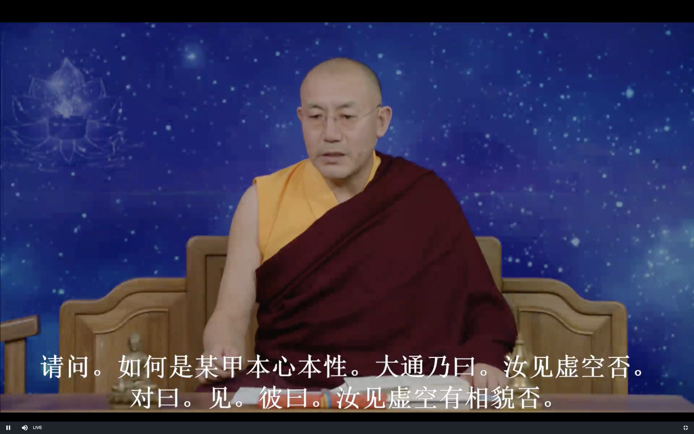
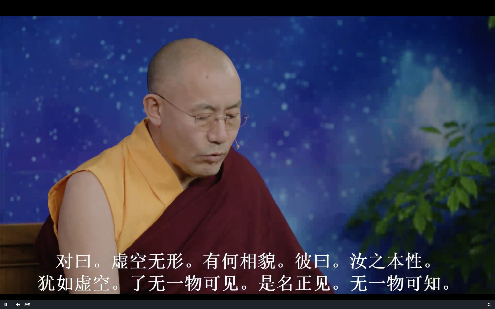
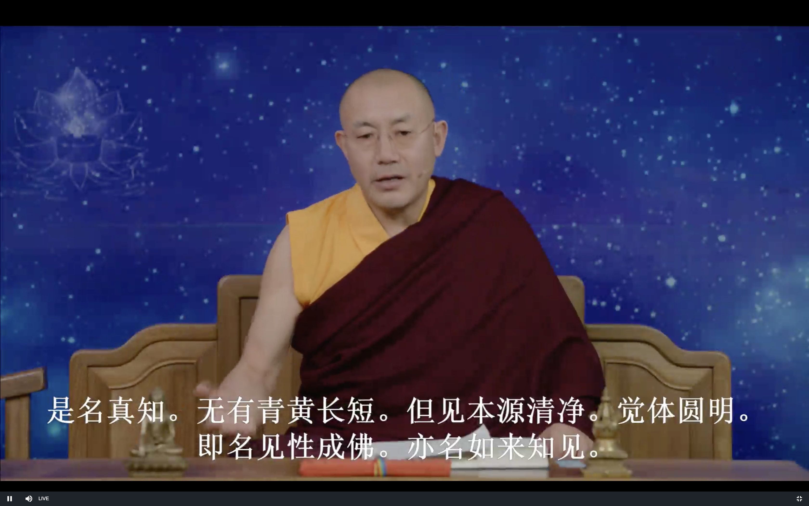
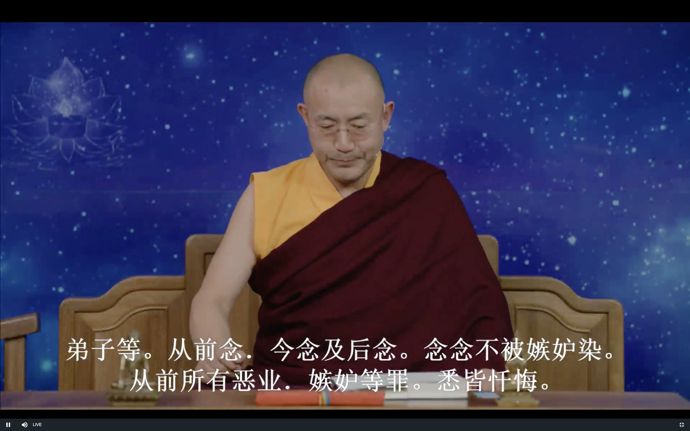
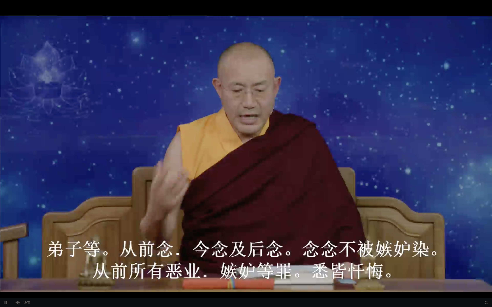
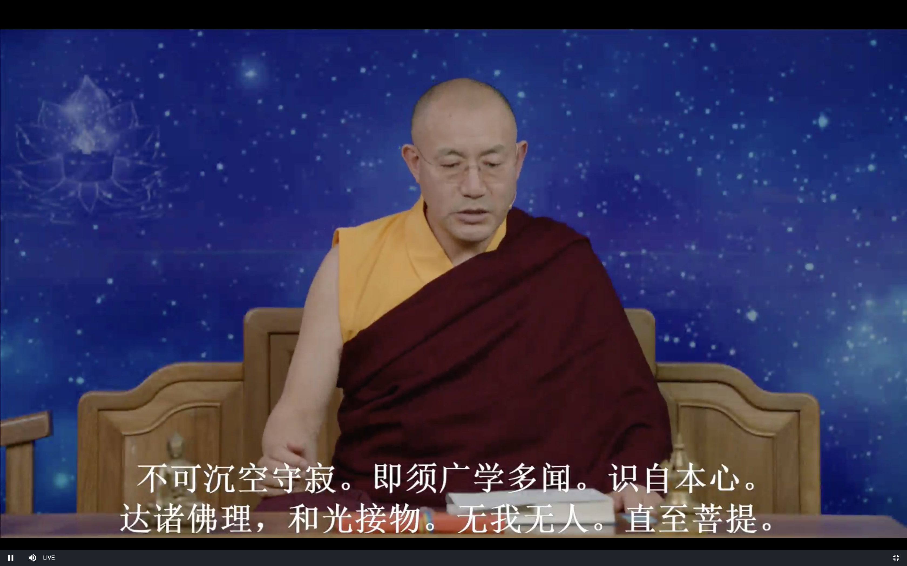
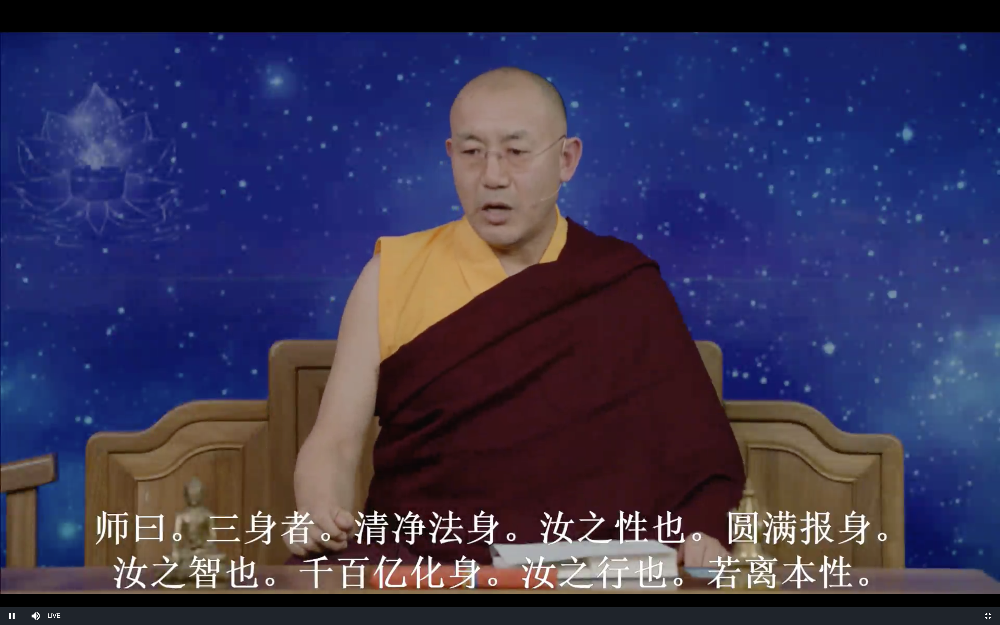
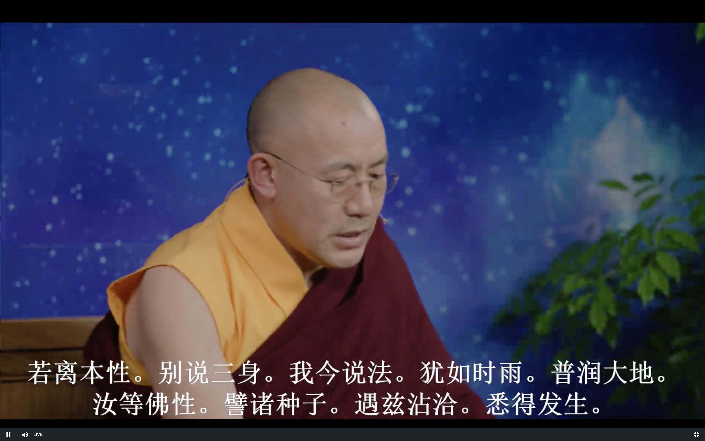

# 坛经 坐禅品

上师10月22日开示

# 发菩提心

## 证悟的内容到底是什么

曹溪原本 和 宗宝本

僧人智常 问 大通禅师

自空中观 主要讲空性 不太强调佛性 主要依据是第二转法轮 金刚经 心经 大般若经 其实就是佛性的一部分

他空中观 主要讲佛性 光明 如来藏 空性也讲但是不是很强调

佛性有两部分 一部分是空性 一部分是光明 是不矛盾的 就像灯 既有光 又有热

佛陀在讲的时候层次很清楚 先讲空性 再讲光明

龙树菩萨基本上讲空性 但是 赞法界论是讲光明如来藏

弥勒菩萨的弥勒五经主要是讲光明

坛经主要是讲他空中观 佛性和光明

敦煌版里 偈子 里有 佛性常清净 

达摩四论 也是强调了佛性 跟密宗是一样 慧可大师的禅宗都是来自于达摩祖师

从这里可以看出坛经是讲他空中观

## 理论跟修法的关系

南传佛教很多保守的僧人不认为大乘佛法是佛讲的 而是龙树菩萨等讲的

大乘佛教就认为佛有二转 三转法轮

问心的本质是什么

大通禅师就回答 你见过虚空吗

那你见过虚空有没有相貌呢 虚空长什么样呢

虚空没有任何形状 怎么有相貌呢

那大通禅师说 你的本性就跟虚空一样 

了解 证悟 意识没有任何一个东西可见 可以发现 这叫做正见

大乘佛教 密宗 很多时候都在重复一句话 没有见到任何东西 就是最殊胜的见

表面上看起来有点矛盾 实际上是可能的 这才是真正的见解 静下来意识自己往里去观照 体验的时候(不是逻辑分析) 念头都是表面的现象 如果穿越这些表面的层次 看到了念头的本质

比如说愤怒 有杂念 非常糟糕的状态 看到了它的本质 虽然没有我们世俗语言所能表达的东西 境界的存在

这个境界就是"无一物可见" 可描述 表达 但是这跟深度睡眠 昏迷的状态是不一样的

这时候是非常清楚的 世俗生活中发生的一切 内心中的各种情绪念头 完全是一个虚拟虚幻的东西 真实的根本就不是这样子 体会到了 "了无一物可见" 这就是证悟 证悟到的就是这个

但是也有很多的误区 禅定的感觉很好的时候 也很像这个状态 "无一物可知" 但这种禅定的平静的感觉不是证悟

怎么去避免呢 就是要修四加行 五加行 祈祷上师 之后就可以穿透这个表面的层面 看到本质

可以去看"恒河大手印" 从头到尾讲我们的内心就像虚空一样 大圆满的续部 也都是在讲这些东西

**无一物可知 是名真知**

知和不知 都是二元对立 在证悟里根本就不存在

也不能说见 和 不见 这些二元对立都是日常生活 世俗的表达 创造出来的语言

我们证悟的就是这个 

静下来 往里看的时候 内心就跟虚空一样 无一物可见 无一物可知 深深的体会到 而不是逻辑推理 更不是自己贴的标签 这就叫做证悟 (心无有心 则曰本净)

**无有青黄长短**

没有各种颜色 没有形状 

**但见本源清净**

仅仅是看见本源清净 除了这个之外没有其他的东西 

慧能大师的偈子 "本来无一物" 就是 "了无一物可见 是名正见 无一物可知 是名真知" 

所有大波若经 压缩到一句话 就是"本来无一物" (空性的部分)

除了这个之外 还有没有别的呢 (有的) "但见本源清净"

本来就是清净的 修和不修都有的

**觉体圆明**

觉悟的本体 智慧 佛的四种智慧用一个字表达就是"觉"  佛原有的智慧 如来藏 藏的意思就是像宝藏一样 埋在我们心里最深的地方

以前我们是理论上知道 现在就是深深的体会到了 内心的本质是清净的

达摩祖师的论里 反复讲烦恼即菩提 意思是烦恼的表面再坏 但是他的本质不坏

杀盗淫妄等业和烦恼 和菩提心的本质都是一样的 

如果我们停留在表面的层次 就是轮回了

如果穿透了表面的层次 就是智慧 **"觉体"** 这是觉悟的本体 智慧的本体

"了无一物可见 是名正见 无一物可知 是名真知" 讲空性(第二转法轮)

"但见本源清净 觉体圆明" 这里就是讲佛性(第三转法轮)

圆 是圆满 完美的意思 明 就是光明 本质是没有任何烦恼的 是清净的

**即名见性成佛 亦名如来知见** 

这就是见性 也就是佛的见解

水幕电影的比喻 不真实

证悟之后 世间的这些欲望 烦恼就会慢慢消失

虚云大师25年修行后证悟

虚云大师说 证悟了以后 有更多的事情要做

如果一个人出门在外 家里有三间房子 后来回来了 房子里到处是灰尘 如果不回来 也不用打扫 回来以后就要打扫

我们证悟也是一样 证悟是一个开始 但是我们有能力把烦恼清理干净 以前是没有机会 没有能力 现在有了

证悟以后 第一个消失的日常生活中的压力 烦恼 工作婚姻的烦恼就一定会消失的

具体方法呢 就是烦恼强烈的时候 让自己静下来 不要管别人怎么样 而是去看自己的念头 去看念头的本质 念头就会消失 或者念头就会失去生命力 只是一个表面的现象而已

而平时我们的烦恼是最有生命力 菩提心就没什么生命力

初步证悟以后 首先消失的是精神上的痛苦 再继续修的话 就会对肉体产生作用 可以控制肉体的痛苦

最后 生老病死 轮回中的一切痛苦都会不怕了

佛教我们的方法 就是用这个强大的力量去面对这个轮回中的痛苦 而不是逃避

这个世界是我们的无明和业力造成的 是不可能逃避的 我们现在就是要去面对 不是用世俗的方法去面对

而是用佛教里面的正确的方法去面对 解脱不是我们人从这个星球消失 离开 到另外一个星球

解脱是消灭了内心的软弱 用佛教给我们的方法去面对 再也不害怕世俗的痛苦 自利利他 这就是大乘佛教的目标 绝对可以落实到生活当中 这是我们这一生中可以实实在在体会到的东西 是活生生的人的经验 

证悟的次第 多数人也是先是空性 再是光明 慧能大师是同时证得 是利根顿悟

初步证悟 不是很难 巩固下来 继续发展就比较难 要有精进

现实生活中不再有恐惧 这才是幸福 这是大乐的境界 超越世俗的快乐 幸福的境界

这个时候我们就会有强大的愿望 让所有人都能从轮回中觉悟 这就是利他 弘法利生

慈善 用物质也很好 但是最后到底是帮助还是害了他 都说不清 佛也不能满足所有众生的需要

把道理讲给他 让他自己去解决 这才是最好的

这个时候心里是慈悲心 做的是利他的事情 他就一定会有幸福快乐

真正的幸福就是来自于利他

## 证悟的利益

1 不惧生死

2 生活琐事不再烦恼

3 利他的快乐 生命有意义

什么是证悟

不是通过思维逻辑

不是语言文字的理解(贴标签)

自己直接感觉到了 领悟 觉悟

了达无一物可见 (要避免禅定中安静感觉的误区) 

嘴巴上说自己证悟的一般不一定的 即便是真的也会有障碍 (违缘 功德要保密)

菩提心 慈悲心会慢慢增长

自己会慢慢看着自己成长 😊

# 第二个内容--忏悔品

这里讲无相忏悔

最最殊胜的忏悔就是无相忏悔

有相的忏悔里面最殊胜的忏悔就是金刚萨埵的修法 最后的融入空性可以是无相忏悔 但整体上是有相忏悔

没有证悟的时候 就没有办法做无相忏悔

有相忏悔可以清除果报 但是不能清除种子

无相忏悔就可以把罪业的种子 连根拔除

## 禅宗也要闻思

不可沉迷有无记的空 心很平静的禅定状态 要广学多闻

龙钦巴尊者也说了 要广学多闻 对证悟是有帮助的

我们以为禅宗只需要修就可以了 对整个佛教是不好的

因为佛教跟其他的宗教不一样 不是一信仰为主 而是以智慧为主

即使是禅宗 六祖慧能大师也是说了要广学多闻

如果没有证悟 而也没有佛教的智慧 自己出了问题就没有办法解决 

佛法里面除了出世间的智慧 还有人生的智慧 所以学习这些方法观念 对世俗的生活也是非常有意义 有帮助的

认识自己心的本性 通达佛的理论 跟生活也不能脱节 落实到生活中的话 

"和光接物"

和光同尘 待人接物 尽量的与世无争 正当的竞争是可以的 但是不要过度的自私 斤斤计较 对别人不要这样 对自己也不要太极端 我们是往这个方向走 将来还是要有很远很远的路要走 

无始以来 自私是已经根深蒂固了 所以不要过度的要求别人 也不要过度的要求自己 实际上也做不到 也没有用

尤其是家人 同学 同事 之间 能让就让 能忍就忍 团结友善 但我们佛教徒也不是没有原则 该出声的时候就出声(上师笑)  如果落实到生活中的时候比无神论者还差就不好了

无我无人 直至菩提

理论上了解不是很难 佛教为什么讲无我 目标就是更好的利益众生 如果有我 那就只能30-40%付出, 60-70%是为了自己 如果无我的话 就可以100%的利他 当然无我也是要有智慧

要点

禅宗也要广学多闻 

为人处世 要跟时代相应 不能被边缘化 否则就不能更好的帮助别人 对自己不利 对禅宗不利 对佛法更加不利

自己内心的境界可以非常高 但是行为 待人接物可以跟普通人一样的 提高很难 降低是很容易的

## 禅宗修行的结果

清净法身是你自己的本性 光明和空性的综合

这个地方的性是 主要指的是空性的部分

智主要指的是 光明的部分 这个跟大圆满是非常一样的

# 参考链接:

### 坛经经文 **参请机缘第六**

http://blog.sina.com.cn/s/blog_6d3b70d70101ki8v.html

僧智常。信州贵谿人。髫年出家，志求见性。一日参礼。师问曰，汝从何来，欲问何事。曰，学人近往洪州白峰山礼大通和尚，蒙示见性成佛之义。未决狐疑，远来投礼。伏望和尚慈悲指示。师曰，彼有何言句，汝试举看。曰，智常到彼，凡经三月，未蒙示诲。为法切故，一夕独入丈室，请问如何是智常本心本性。大通乃曰，汝见虚空否。对曰，见。彼曰，汝见虚空有相貌否。对曰，虚空无形，有何相貌。彼曰，汝之本性，犹如虚空。返观自性，了无一物可见，是名正见。了无一物可知，是名真知。无有青黄长短，但见本源清净，觉观圆明，即名见性成佛。亦名极乐世界。亦名如来知见。学人虽闻此说，犹未决了。乞和尚开示。师曰，

 

师所说，犹存见知，故令汝未了。吾今示汝一偈。

 

不见一法存无见 大似浮云遮日面

不知一法守空知 还如大虚生闪电

此之知见瞥然兴 错认何曾解方便

汝当一念自知非 自己灵光常显现

 

常闻偈已，心意豁然，乃述偈曰。

 

无端起知见　着相求菩提　　情存一念悟　宁越昔时迷

自性觉源体　随照枉迁流　　不入祖师室　茫然趣两头

 

智常一日问师曰，佛说三乘法，又言最上乘。弟子未解，愿为教授。师曰，汝观自本心，莫著外法相。法无四乘，人心自有等差。见闻转诵，是小乘。悟法解义是中乘。依法修行是大乘。万法尽通，万法俱备，一切不染，离诸法相，一无所得，名最上乘。乘是行义，不在口争。汝须自修，莫问吾也。一切时中，自性自如。常礼谢，执侍终师之世。