达摩血脉论

上师开示2019 10/27

# 发菩提心

# 达摩祖师血脉论

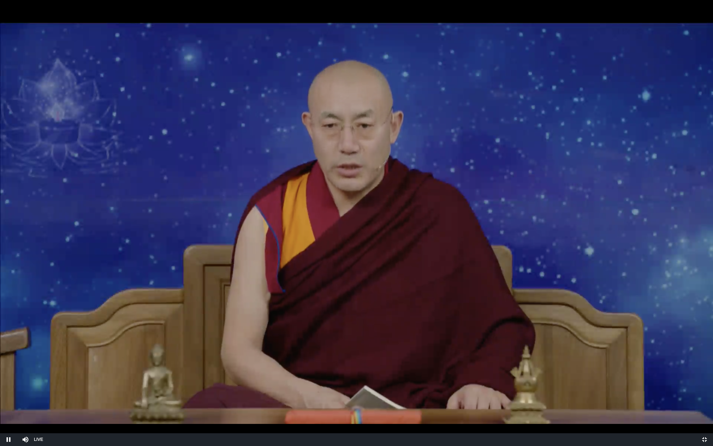

禅宗1500多年

佛法的传播很不容易 历史上有很多人的努力 今天大家学法 听法要珍惜

血脉论是佛教 最最最顶尖的智慧

禅宗的智慧 像是六祖坛经 血脉论 跟大圆满 大手印 唐密 还有般若波罗密多的智慧 都是一样的 是佛教最顶尖的智慧

藏传佛教里达摩祖师叫菩提达摩

禅宗是心传心 所以留下来的文字不是很多

血脉论 从名字就可以知道 这部论典的重要性 就像人体的血液一样重要

佛经取名 有很多方法 这个是以比喻命名

胜道(讲内容)宝鬘(比喻)论

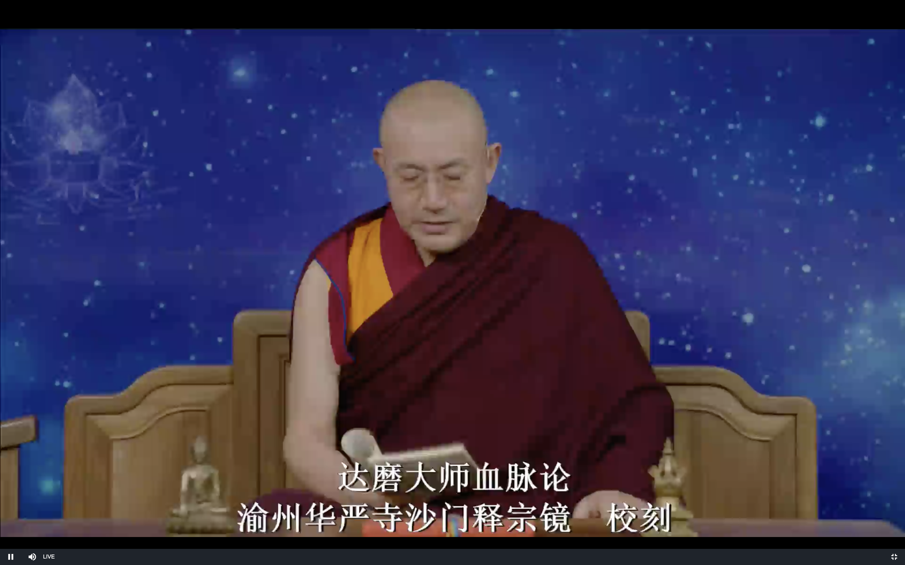

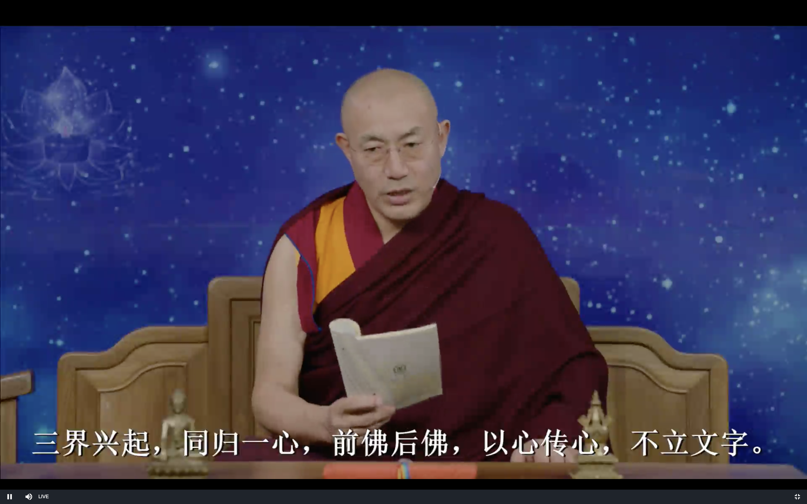

三界兴起 同归一心

万法归一 一法归零

就是讲的这八个字

佛法分窍诀派(实修派)和理论派(学院派)

窍诀派的特点 不太会去观察外在世界 物质结构等等 (大乘阿毗达摩讲外在的世界讲的很清楚)

他们认为这都是内心的投影 所以没有必要到外面的世界研究

六道轮回 分欲界 色界 无色界 就是三界

人的心就是分三种层次

外面的

人道就有生老病死的痛苦 烦恼很粗大 投射出来的 就是欲界

心稍微更加平静的 比方说四禅 心投射出来的就是很细微 这就像能量(不是粗大的物质)构成的另外一个世界

没有生老病死 要比我们欲界大很多

举个例子 就像我们能观测到的只有4% 剩下的96%就是观测不到的暗物质

无色界 我们看不见 并且他们相互之间也看不见 生命在禅定中开始 禅定中结束

欲界的欲望相对来说比较强烈

六道中除了天道 其余五道都是色界

天道 就分欲界 色界 无色界三种

嗔恨心 力量很大的 强大到一定程度就会投射出地狱道

吝啬心 也是 强大到一定程度就会投射出 恶鬼道

嗔恨心是因 地狱是果 吝啬心是因 饿鬼道是果

理论派不会到心里去找 而是向外面找 就跟科学家一样 像"大乘阿毗达磨"

窍诀派就直接到心的内部去找

年轻的时候可以先学理论派 弘法利生就很有帮助的

**三界兴起** 三界的来源是什么 

**同归一心** 都是归于自己的内心

以前讲万法归一 这是大乘佛法的观点

很多人就问三界的来源是什么 第一个意识是从哪里来的

显宗里找不到答案.

密宗里有 而且后面怎么发展 都有讲的

现代的物理学家 也在讲 我们不观察的时候 这个宇宙存不存在呢 这听起来有些奇怪 其实不是的

禅宗的这些文字特别少 但是浓缩了佛经的精华

**前佛后佛 以心传心**

法轮象征整个的佛教 为什么用车轮来代表呢 因为轮子可以转动

代表这个法是可以滚动 转动的

语言文字是口耳相传 但最重要的是 戒定慧 内在的智慧就是要转动的 从上师的心传给我们的心

大圆满心性休息 是心性 不是心

这里要注意文字的区别 心性和心是不一样的 心一般就指的是眼耳鼻舌身意 意识心表面的情绪

这里的心 就是指心性 心的本性 智慧

无垢光尊者之前的大圆满是没有文字的

七八十年前的一些上师们也是很担心 会失传

禅宗里的达摩祖师 这么重要的祖师 就只有很少的文字 只有达摩四论

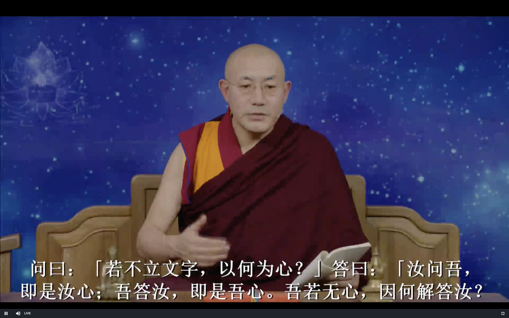

佛像 这两个字 如果提问题和回答问题都要在心里产生同样的形象

文字系统分两种: 字母文字和形象文字

语言文字可以作为载体 但真正传播的不是这个文字 语言

听得见 和 听得懂的差别

听得懂是通过约定 靠的就是心

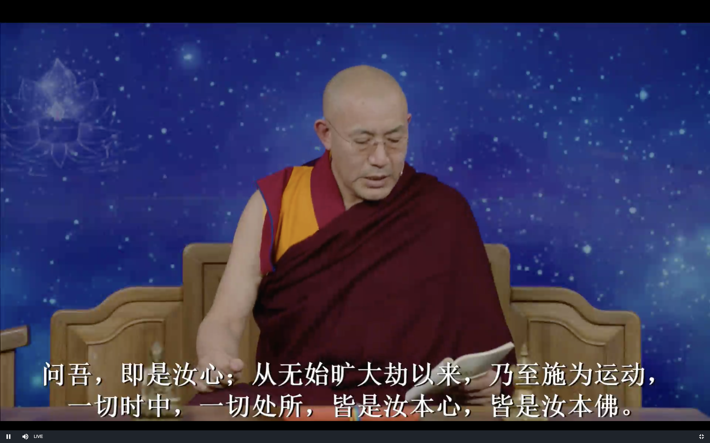

任何时候都是我们的心在操作

从本质上讲

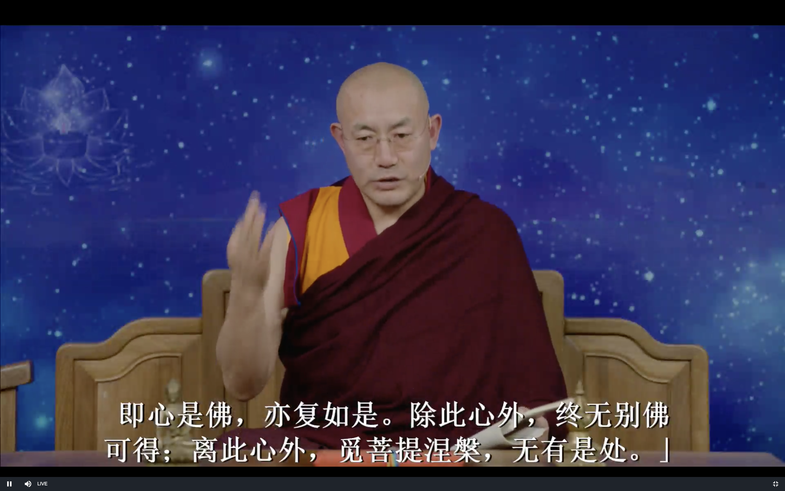

证悟以后就能体会到心就是佛 心的本性是佛

彻底落实的 只有大圆满

可以参考 黑蛇总义

误区 贪嗔痴不是佛

心的本性 才是 但我们看不到 证悟以后才可以看到

讲赞法界论 

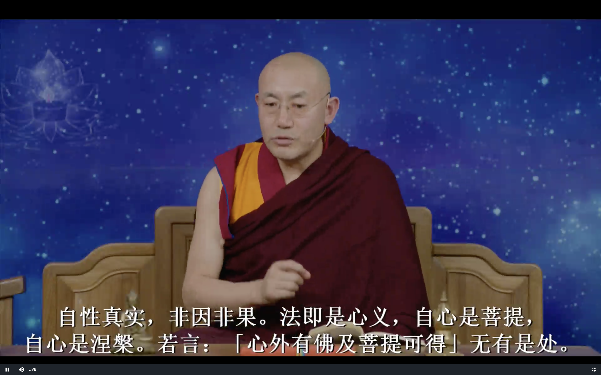

冰变成水 水变成冰

心最终留下来的是真实 是光明 也是空

所以跟大中观也不冲突

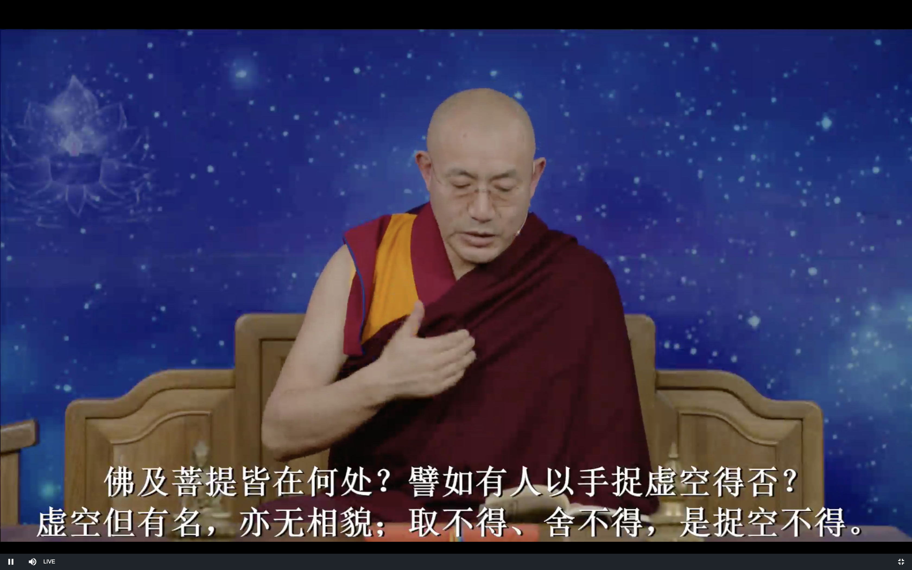

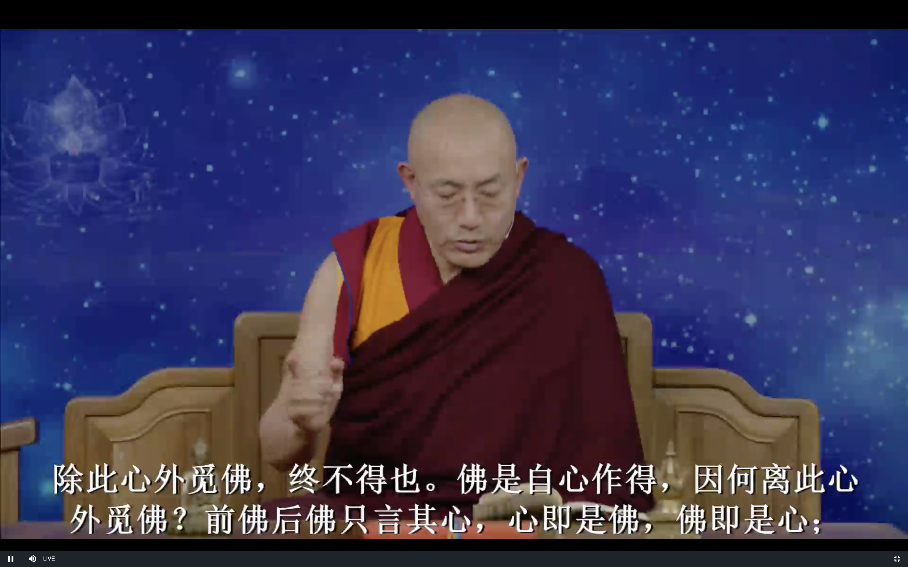

反而心最后就被无情物控制住了 物质主义者 实际上是我们的欲望控制了我们

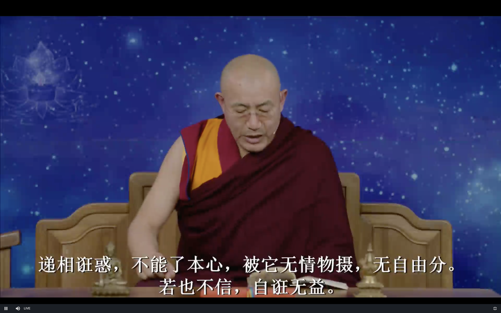

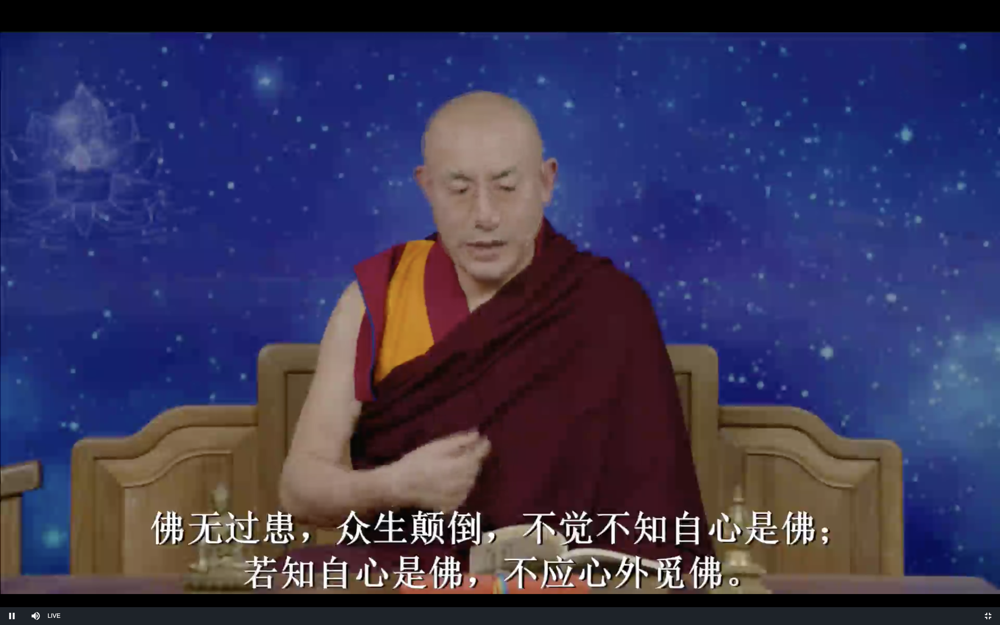

**心即是佛** 了解这一句话就可以了 其他的都是围绕这一句话来讲的

回向

像三十五佛忏悔文里那样 

