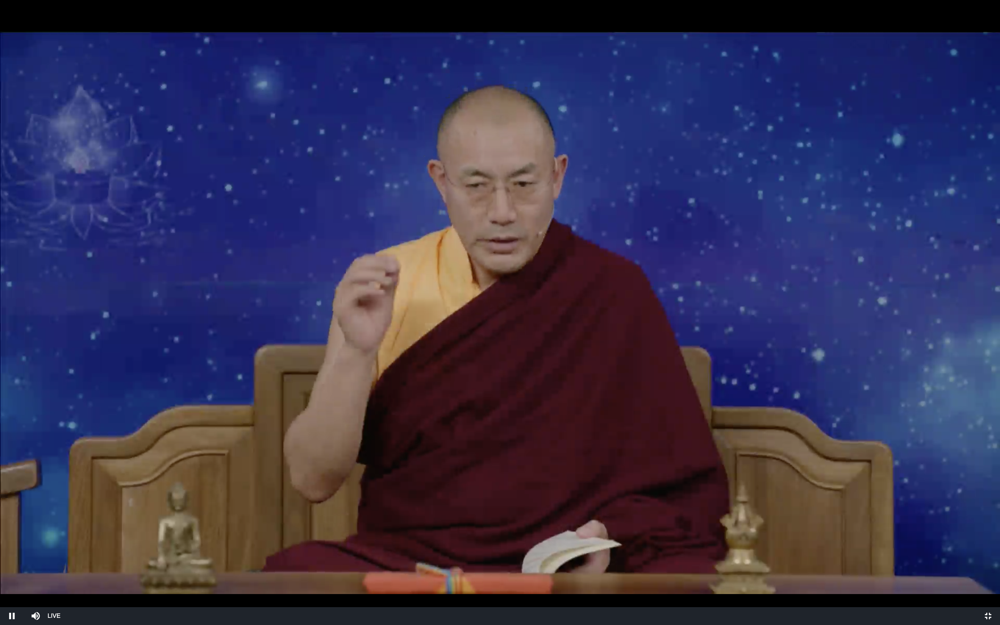
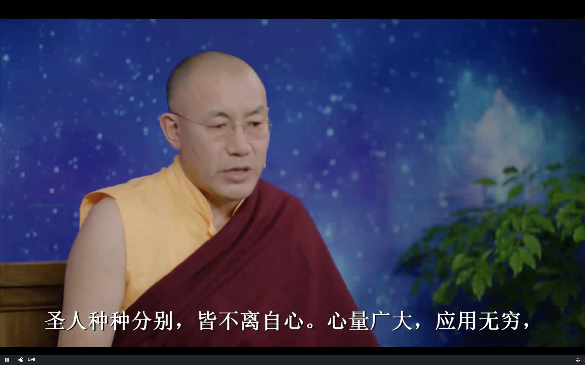

达摩血脉论

上师开示2019 11/12

# 发菩提心

# 达摩祖师血脉论

### 用烦恼的泥巴来种金莲花

外界的因缘并不是让我们快乐痛苦的真正原因 我们自己内心对待外界因缘的态度才是

各种各样的烦恼情绪 不是来自于外界 也不是来自于我们心灵的内部 我们心灵内部是一个非常清净的状态

当我们把内心的门打开后 看到我们真正的内心 内心的本性之后

平时粗大的烦恼 就开示瓦解 可以断除了 (胜义谛/证悟)

烦恼的真实来源是我们的无知 错误的观念 佛就是鼓励我们从另外一个角度去看问题

这样平时听到有人说自己坏话 故意的伤害自己 也不会给自己带来痛苦了 就像看电视的时候换了一个开心的频道(世俗谛/方便)

证悟以后 自己的烦恼断除 也可以给他人带来快乐

学佛的目标--"智慧" "慈悲"

就是提升自己的智慧到达巅峰 扩大自己的慈悲心

**圣人种种分别，皆不离自心。心量广大，应用无穷，**

证悟的人叫做圣人 种种分别 就是分别念 圣人也有念头 八地菩萨以下都是有念头的

这些念头 每一个念头 都离不开证悟的智慧 都不离开证悟的自心 (这里讲的是心的本性 不是我们的第六意识) 不证悟的话 不叫圣人 而是凡夫

般若波罗蜜多 叫做佛母 是所有僧人 圣人的母亲 圣人要靠般若智慧来证悟

凡夫人心量不广大  装不下 就会执著 就会让自己烦恼 有一丁点的执著 它就会像毒瘤一样带来痛苦

自己比别人好一点点 就傲慢 自己比不上别人 就攀比嫉妒

证悟之后就会大平等 就会心量广大 生活中还能有什么不快乐的事情呢 (除非是温饱的问题)

(我们凡夫人 就是没有被设计好 不观察还好 观察的时候就会有太多的漏洞)

我们的内心是没有任何局限性的 完全可以达到佛的境界

物质有物质的价值 但精神有更大的价值 更多的应用 而且是无穷的

现代的西方医学研究认为76%的疾病是我们的负面情绪制造的

那正面的情绪 也就会对健康有好处 我们的满足感 自我价值最终也是由利他心来实现 也就是应用无穷

**应眼见色，应耳闻声，应鼻嗅香，应舌知味，乃至 施为运动，皆是自心。**

证悟的人内心完全可以处于智慧的状态 六根六识还可以运动

比方说看到一个东西 好看的 就产生欲望 不好看的就嗔恨心 说不上喜欢不喜欢的 是无明 无知愚昧的状态

就是贪 嗔 痴的三种状态 证悟以后就不是 而是处于智慧的状态

大圆满当中叫做 六根自解脱

看到东西以后 产生贪嗔痴 就不自在 就叫做不自解脱

证悟的人 看到东西以后 就不会有贪嗔痴 就叫做自解脱

**一切时中但有语言，即是自心。**

证悟的人说话的时候 只有语言 没有情绪

比方说佛转法轮的时候 只有语言 是没有情绪 分别念的 没有执著  这个地方的自心就是证悟的心 不是我们凡夫人的分别心

**故云 如来色无尽，智慧亦复然。**

我们的眼睛可以看到的维度(光谱)是有限的 

佛的眼睛看到的是无尽的维度(波长), 也可以听(耳朵也是一样, 六根互用), 佛陀的智慧也是无穷无尽的

无尽也是因为一切都是空性

**色无尽是自心，心识善能分别一 切，乃至施为运用，皆是智慧。**

佛从一个原子上面也可以看到一个完整的宇宙

一个宇宙也是一个粒子 佛就打破了大和小的局限 (全息宇宙理论???)

佛陀当时很多外道的修行人 都可以看到物质内部的很细微的结构

阿罗汉 菩萨 佛陀的境界就更加的深入 宽广

普贤行愿品里 佛陀就善能分别

我们用科学仪器来观察世界 最后还是要用眼睛 所以有局限性

证悟的人 都是用证悟的智慧

包括睡眠 都可以用梦瑜伽来在智慧中进行

**心无形相，智慧亦无尽。故云如来色无尽，智慧亦复然。**

无形相不等于空性 比方说空气 也无形无相 但不是空性

证悟的人做事的时候处于无形相的状态 智慧也是无尽的

**四大色身，即是烦恼，色身即有生灭，法身常住而无所住，如来法身常不变异，**

"四大" 大小乘的理解是不同的

心的本性跟身体是不一样的 本身就是空性 所以无所住 法身也是永恒不变化的 自然也不会有烦恼

别人的坏话是最容易容忍的 身体上受到伤害可能会严重一点

但我不配合这个坏话的话 声音就是一个震动耳膜的压力波 根本就震动不了我们的心

理性的分析一下 别人的坏话只是让我们产生烦恼的一部分的原因

入行论里讲的很清楚 

佛教里讲缘起 每一个果都会有很多因缘 任何一个因缘不具备的话 果都不会出现

所以我们自己不配合的话 就不会痛苦 我们自己很配合的话 就会因为别人的语言而产生烦恼

佛教就是靠自己的力量去解决烦恼 而不是靠鬼神 这个力量是怎么产生的呢 就是通过智慧看到这个烦恼产生的过程 然后去锻炼

科学的发现有一个过程 比方说不健康的心理会导致疾病 最初是日本科学家发现的

心灵的研究最透彻的是佛教 心有自己的结构和变化的规律 

**故经云: 众生应知，佛性本自有之。迦叶只是悟得本性，本性即是心， 心即是性，性即此同诸佛心。**

证悟自己的本性 跟佛就是同一个心

**前佛后佛只传此心，除此心外，无佛可得。颠倒众生不知自心是佛，向外驰求，终日忙忙;** 

佛教的标志就是一个法轮 

车轮就是可以转动的 佛也是可以把心中的开悟 证悟的智慧 传给下一代 代代相传

前佛后佛都是在传这个光明的心 

颠倒众生 就是我们 比方说颜色根本就是不存在的 我们却看到各种颜色 这不就是颠倒吗

我们看到的桌子 本来是电子 分子 我们看到的却是根本不存在的桌子的形象 这也是颠倒(错觉)

**念佛礼佛，佛在何处?不应作如是等见，但识自心，心外更无别佛。**

大雄宝殿里的不是佛 只是土木金属

只要认识自己的心 我们的心就是佛 

经云:凡所有相，皆是虚妄。又云:所在之处，即为有佛，自心是佛，不应将佛礼佛;

相 就是我们能感觉到的 大脑中产生的画面 都是错觉 就是虚妄

真正的佛就在内心当中 不要到外面去找 自己的心就是佛 用佛去礼佛 用法身佛礼外面的有形相的佛

这里要区别本质上的佛和日常生活表面上的行为 上面是从证悟的观点来讲的

**但是有佛及菩萨相貌，忽尔见前，切不用礼敬。我心空寂，本无如是相貌，若取相 即是魔，尽落邪道。**

打坐的时候 有时候会看到佛菩萨的形象 这个跟密宗讲的是一样的

这个不是自己观想出来的 真的是看到的 这个时候应该怎么办呢

米拉日巴的弟子 冈波巴大师 学习了13个月 有一次打坐的时候看到了漫天都是观世音菩萨 每个观音菩萨的头上都有一个月轮

米拉日巴尊者说这个 也不是功也不是过 不是好也不是坏 是自己气脉明点的运行导致的

有一天有看到了地狱 米拉日巴尊者说这是因为打坐的姿势不对 都不是功也不是过 最后自然就消失了

修行人这种情况会是很多的

有个近代修行人 修断法 要去故意得罪鬼神 被得罪的鬼神会打雷啊等等 制造各种恐怖的形相 修行人的我执就会特别强烈 这个时候就是把我执引出来 用金刚波罗蜜多就的智慧把它断掉 这个人每次打坐的时候就会从天花板上掉下来一个东西 有一天他就想捅一刀 然后问上师 上师说先别忙捅刀 先打个记号 第二天就发现这个记号就在自己的肚子上

还有虚云大师在终南山打坐 有一天动了一个念头想吃面条 下午的时候就有一个女施主就带了一桶面条来

他就先念咒供佛 供佛的时候这个女施主就跑掉了 然后发现这个桶里的面条全部就变成了毛毛虫

我们现在就先不要害怕 我们还没有到这个程度

这个时候就继续打坐 这些都是心的现象

若是幻从心起，即不用礼。礼者不智， 智者不礼，礼被魔摄。恐学人不知，故作是辨。诸佛如来本 性体上，都无如是相貌，切须在意。但有异境界切不用采括， 亦莫生怕怖，不要疑惑，我心本来清净，何处有如许相貌。 乃至天龙夜叉鬼神帝释梵王等相，亦不用心生敬重，亦莫怕 惧;我心本来空寂，一切相貌皆是妄见，但莫取相。若起佛 见法见，及佛菩萨等相貌，而生敬重，自堕众生位中。若欲 直会，但莫取一切相即得，更无别语。故经云:凡所有相， 皆是虚妄。都无定实，幻无定相。是无常法，但不取相，合 它圣意。故经云:离一切相，即名诸佛。
问曰:因何不得礼佛菩萨等?
答曰:天魔波旬阿修罗示见神通，皆作得菩萨相貌。种种变 化，是外道，总不是佛。佛是自心，莫错礼拜。佛是西国语， 此土云觉性。觉者灵觉，应机接物，扬眉瞬目，运手动足， 皆是自己灵觉之性。性即是心，心即是佛，佛即是道，道即
    是禅。禅之一字，非凡圣所测。
又云:见本性为禅。若不见性，即非禅也。假使说得千经万 论，若不见本性，只是凡夫，非是佛法。至道幽深，不可话

 会，典教凭何所及。但见本性，一字不识亦得。见性即是佛， 圣体本来清净，无有杂秽。所有言说，皆是圣人从心起用。 用体本来空，名言犹不及，十二部经凭何得及。道本圆成， 不用修证。道非声色，微妙难见。如人饮水，冷暖自知，不 可向人说也。唯有如来能知，余人天等类，都不觉知。凡夫 智不及，所以有执相。不了自心本来空寂，妄执相及一切法 即堕外道。若知诸法从心生，不应有执，执即不知。若见本 性，十二部经总是闲文字。千经万论只是明心，言下契会， 教将何用?至理绝言;教是语词，实不是道。道本无言，言 说是妄。若夜梦见楼阁宫殿象马之属，及树木丛林池亭如是 等相;不得起一念乐著，尽是托生之处，切须在意。临终之 时，不得取相，即得除障。疑心瞥起，即魔摄。法身本来清 净无受，只缘迷故，不觉不知，因兹故妄受报。所以有乐著， 不得自在。只今若悟得本来身心，即不染习。若从圣入凡， 示见种种杂类，自为众生，故圣人逆顺皆得自在，一切业拘 它不得。圣成久有大威德，一切品类业，被它圣人转，天堂 地狱无奈何它。凡夫神识昏昧，不同圣人，内外明彻。若有 疑即不作，作即流浪生死，后悔无相救处。贫穷困苦皆从妄
    想生，若了是心，递相劝勉，但无作而作，即入如来知见。 初发心人，神识总不定;若梦中频见异境，辄不用疑，皆是 自心起故，不从外来。梦若见光明出现，过于日轮，即余习 顿尽，法界性见。若有此事，即是成道之因。唯自知，不可

 向人说。或静园林中行住坐卧，眼见光明，或大或小，莫与 人说，亦不得取，亦是自性光明。或夜静暗中行住坐卧，眼 睹光明，与昼无异，不得怪，并是自心欲明显。或夜梦中见 星月分明，亦自心诸缘欲息，亦不得向人说。梦若昏昏，犹 如阴暗中行，亦是自心烦恼障重，亦自知。若见本性，不用 读经念佛，广学多知无益，神识转昏。设教只为标心;若识
 心，何用看教?若从凡入圣，即须息业养神，随分过日。若 多嗔恚，令性转与道相违，自赚无益。圣人于生死中，自在 出没，隐显不定，一切业拘它不得。圣人破邪魔，一切众生 但见本性，余习顿灭。神识不昧，须是直下便会，只在如今。 欲真会道，莫执一切法;息业养神，余习亦尽。自然明白， 不假用功。外道不会佛意，用功最多;违背圣意，终日驱驱 念佛转经，昏于神性，不免轮回，佛是闲人，何用驱驱广求 名利，后时何用?但不见性人，读经念佛，长学精进;六时 行道，长坐不卧;广学多闻，以为佛法。此等众生，尽是谤 佛法人。前佛后佛，只言见性。诸行无常，若不见性，妄言 我得阿耨菩提，此是大罪人。十大弟子阿难多闻中得第一， 于佛无识只学多闻，二乘外道皆无识佛，识数修证，堕在因
  果中。是众生业报，不免生死，远背佛意，即是谤佛众生， 杀却无罪过。经云:阐提人不生信心，杀欲无罪过。若有信 心，此人是佛位人。若不见性，即不用取次谤它良善，自赚 无益。善恶历然，因果分明。天堂地狱只在眼前，愚人不信，

 现堕黑暗地狱中;亦不觉不知，只缘业重故，所以不信。譬 如无目人，不信道有光明，纵向伊说亦不信，只缘盲故，凭 何辨得日光;愚人亦复如是。现今堕畜生杂类，诞在贫穷下 贱，求生不得，求死不得。虽受是苦，直问著亦言我今快乐， 不异天堂。故知一切众生，生处为乐，亦不觉不知。如斯恶 人，只缘业障重故，所以不能发信心者，不自由它也。若见 自心是佛，不在剃除须发，白衣亦是佛。若不见性，剃除须 发，亦是外道。
问曰:白衣有妻子，淫欲不除，凭何得成佛? 答曰:只言见性，不言淫欲。只为不见性;但得见性，淫欲 本来空寂，自尔断除，亦不乐著，纵有余习，不能为害。何 以故?性本清净故。虽处在五蕴色身中，其性本来清净，染 污不得。法身本来无受，无饥无渴，无寒热，无病，无恩爱， 无眷属，无苦乐，无好恶，无短长，无强弱，本来无有一物 可得;只缘执有此色身，因即有饥渴寒热瘴病等相，若不执， 即一任作。若于生死中得自在，转一切法，与圣人神通自在 无碍，无处不安。若心有疑，决定透一切境界不过。不作最
  好，作了不免轮回生死。若见性，旃陀罗亦得成佛。 问曰:旃陀罗杀生作业，如何得成佛?

 答曰:只言见性不言作业。纵作业不同，一切业拘不得。从 无始旷大劫来，只为不见性，堕地狱中，所以作业轮回生死。 从悟得本性，终不作业。若不见性，念佛免报不得，非论杀 生命。若见性疑心顿除，杀生命亦不奈它何。
自西天二十七祖，只是递传心印。吾今来此土，唯传顿 教大乘，即心是佛，不言持戒精进苦行。乃至入水火，登于
 剑轮，一食长坐不卧，尽是外道有为法。若识得施为运动灵 觉之性，汝即诸佛心。前佛后佛只言传心，更无别法。若识 此法，凡夫一字不识亦是佛。若不识自己灵觉之性，假使身 破如微尘，觅佛终不得也。
佛者亦名法身，亦名本心，此心无形相，无因果，无筋 骨，犹如虚空，取不得。不同质碍，不同外道。此心除如来 一人能会，其余众生迷人不明了。此心不离四大色身中，若 离是心，即无能运动。是身无知，如草木瓦砾。身是无性， 因何运动。若自心动，乃至语言施为运动，见闻觉知，皆是 动心动用。动是心动，动即其用。动用外无心，心外无动。 动不是心，心不是动。动本无心，心本无动。动不离心，心 不离动。动无心离，心无动离，动是心用，用是心动。动即
 心用，用即心动。不动不用，用体本空。空本无动，动用同 心，心本无动。故经云:动而无所动，终日去来而未曾去， 终日见而未曾见，终日[口*笑]而未曾[口*笑]，终日闻而未 曾闻，终日知而未曾知，终日喜而未曾喜，终日行而未曾行，

终日住而未曾住。故经云:言语道断，心行处灭，见闻觉知， 本自圆寂。乃至嗔喜痛痒何异木人，只缘推寻痛痒不可得。 故经云:恶业即得苦报，善业即有善报，不但嗔堕地狱，喜 即生天。若知嗔喜性空，但不执即业脱。若不见性，讲经决 无凭，说亦无尽。略标邪正如是，不及一二也。
颂曰: 心心心难可寻，宽时遍法界，窄也不容针。 我本求心不求佛，了知三界空无物。 若欲求佛但求心，只这心这心是佛。 我本求心心自持，求心不得待心知。 佛性不从心外得，心生便是罪生时。
偈曰:
吾本来此土。 传法救迷情。一华开五叶。 结果自然成。
达摩大师血脉论终