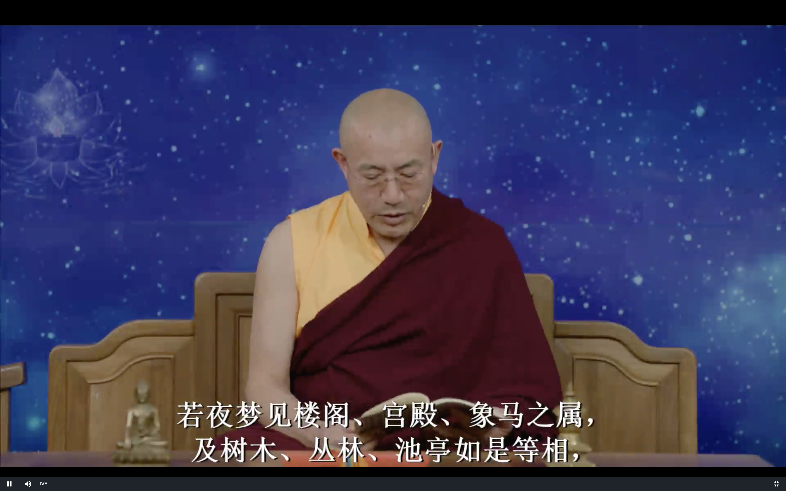

达摩血脉论

上师开示2019 11/13

# 达摩血脉论

## 发菩提心

## 回顾

修禅的人看到佛像 大雄宝殿里的泥塑的 各种唐卡 

或者是打坐的时候看到的佛 或者佛的坛城

这个是有三种可能:

1. 是我们自己气脉明点的现象 不要去关注 (内)
2. 根本就不是佛 而是魔王波旬的化现 来障碍修行人 产生欢喜 然后就是傲慢 (外)
3. 真的看到了佛菩萨 (外)

不管是哪一种 打坐的时候不要去理睬 即便是真实的佛的坛城 也不过是内心的法身佛的一个投影 还不如内心真正的法身佛 报身 化身佛 还不是真正的佛 真正的 最究竟的佛是佛的法身 这时候我们不用磕头 安住空性就是最好的了

很多时候是自己的错觉 或者是大自然的现象 学佛人不要太迷信 盲目 要用智慧

比方说看到彩虹🌈 就说观音菩萨 阿弥陀佛出来了 还有佛光啊 其实都是自然现象

峨眉山的佛光肯定有特殊的加持 但不是说所有的由雾造成的彩虹都是佛菩萨的瑞相 这都不好说 不要太在乎

有一些稍微不一样的云彩 就磕头啊 热泪盈眶 这些行为要注意 

佛就在内心 外在的不要盲目崇拜

另外一个就是不顶礼 恭敬外在的佛像 (也不对, 不要堕两边)

佛像开光之后 这个佛像就有一种特殊的能力 

没有开光的佛像 也有加持的能力 这是来自于佛菩萨多生累世的修行的力量 他们的愿力

可以帮助我们调解心情 烦恼 违缘等等 这时候祈祷佛菩萨 可以得到帮助 这就是来自于佛菩萨的愿力 这个也都是存在的

虽然我们在修空性 修光明的时候就不依赖外在的佛 即使是修禅的人也需要礼佛 供佛

龙树菩萨也是供佛 礼佛的 这个平时都很重要

**佛是西国语，此土云觉性。觉者灵觉，应机接物，扬眉瞬目，运手动足，皆是自己灵觉之性。**

灵觉 就是觉悟之后 佛有大智慧 可以看到 根据各种众生不同的根基 接收引导摄受他们 讲不同的法

真正要利益众生 有几个前提条件 其中有一个就是最好就是有神通 他心通 非常清楚的知道这些人在 想什么

他的需求是什么 可以根据众生的烦恼讲法 另外可以知道未来的变化

虽然佛教不追求神通 但是神通可以作为弘法利生的手段

如果没有神通 但是了解众生的生活文化背景等等 比方说现代女性的烦恼是什么 老人的烦恼是什么 这样讲法的时候会有针对性 否则就只是根据自己的想法去讲法 可能反而会断掉众生的善根
阿底峡尊者说过 如果没有神通的话 可以算命 打卦也可以应机接物 了解他人 也可以帮助别人

眨眼啊 说话 运动 都是佛的觉悟的境界当中 无时不在觉悟的境界当中 所以叫做觉悟者

普通人 从一地菩萨到八地菩萨 境界是很高的 但也不是一天24小时都处在这种觉悟的状态 我们普通人就更不用说了 打坐和日常生活的界限是非常明显的 

**性即是心，心即是佛，佛即是道，道即是禅。禅之一字，非凡圣所测。**

五道十地 最后一个道就是无学道 不需要学习了 就是成佛了

最高境界的禅就是佛的境界 佛的智慧

一地菩萨的见道 二地菩萨的修道 都是道 十一地就是佛

禅这个字 并不是所有的凡夫和圣者所了解(测度) 证悟的 就是深奥 深不可测的内容

因为禅最究竟的意思就是讲心的本性 光明 只有圣者当中的一部分可以证悟 大乘佛教的一部分修行人才可以证悟  小乘佛教的声闻缘觉 阿罗汉 就没有证悟这个

**直见本性，名之为禅。若不见本性，即非禅也。假使说得千经万论，若不见本性，只是凡夫，非是佛法。**

禅有广义 和狭义

广义的包含四禅八定 凡夫外道都可以修 这里讲的外道和达摩祖师讲的外道是不一样的

达摩祖师讲的外道 就是没有证悟达摩祖师讲的这个境界的 包括小乘阿罗汉 所有的皈依的佛教徒都算

这里讲的外道是没有皈依三宝的

这里讲的狭义的禅 指的是证悟的智慧

**至道幽深，不可话会，典教凭何所及？但见本性，一字不识亦得。**

佛法很深奥 不可以通过语言证悟的 书本是不能达到的 如果见到了本性 一个字不认识也是可以的

六祖大师不识字 但是不妨碍证悟 文化水平跟证悟没有直接的关系 文化水平 闻思当然有帮助

**见性即是佛，圣体本来清净，无有杂秽。所有言说，皆是圣人从心起用。**

彻底的见到了心的本性 就是佛了

八地菩萨 九地菩萨也还是有一些细微的执著 也就是说没有彻底看到心的本性

开悟不是成佛 不能这样理解 开悟是开始成佛 彻底的见到了心的本性才是成佛

圣体 指的是心的本性 本来清净 没有烦恼污染 烦恼污染都是处于心的表面 而不是在心的本体上面

用这个字 在坛经里我们也讲了 就是作用 就是我们的意识

我们的意识去思考 判断 它的本体就是佛性 心的本性

圣人 如果是佛的话 就是智慧 不是意识

八地菩萨 大部分是智慧 七地菩萨和以下的也会用意识传法

**用体本来空，名言尚不及，十二部经凭何得及？道本圆成，不用修证。道非声色，微妙难见。**

用和体 本来都是空性的 名言永远都没有办法表达的很清楚

有些时候 日常生活中的 比方说甜味 最早的没有人类语言的时候 有一群人聚在一起 形成了一个共识 比方说甜这个字 这个味道 如果有人从来没有尝过甜的味道 这个就永远没有办法表达清楚的

所以语言就是建立在一个错误的理解上面的 但是我们的日常沟通就还是必须建立在语言上

甜这个字 和我们尝到的味道是没有任何的实际的关系的 我们认为有关系 这个就是错误的理解 但我们还是建立在这个错误的基础上

空性呢 因为我们还没有证悟 语言也是没有办法表达 日常生活呢 比如说甜 我们都尝到过 所以可以表达

而光明 佛性呢 我们没有证悟 所以空性 光明啊 这些字是没有办法形容的 完全是未知的区域 根本就不知道在说什么

十个人尝过甜 就知道我们在说什么 第十一个人没有尝过甜的味道 他就不知道这十个人在说什么

佛讲了十二部经这么多 还是没有办法达到的

佛性本来就是存在的 圆满的 不需要修证来创建

道跟声音 感官看到的世界是没有关系的

怎么证明呢? 并不是所有的真理都可以表达出来 表达是需要有条件的 对什么人表达 用什么来表达

比方说虽然对方没有吃过蜂蜜 但是吃过其他的甜的味道 还是可以大概的了解的 但是没有办法直接证明

同样道理 道也是不能用感官体会到的世界来证明的

如人饮水，冷暖自知，不可向人说也。唯有如来能知，馀人天等类，都不觉知。

就像一个人喝水 冷热他自己知道 不需要证明 这个不是回避 就是刚才讲的原因

证悟的境界也没法描述 不只是空性 疼痛的感觉也没法精确的表达出来

大家有过同样的体验 相同的约定 这样子才可以用语言沟通

学外语就是参与他们的约定 

只有佛才能知道 其他的人 天人等众生 不会彻底的了解心的本性 一地菩萨 八地菩萨还是知道心的本性的

**凡夫智不及，所以有执相。不了自心本来空寂，妄执相及一切法，即堕外道。**

凡夫的智慧没有达到 有执著 不了解心的本性是空性

妄想执著 外面的相 就堕外道 就是没有证悟的 都是叫做外道 这个跟平时讲的外道是不一样的

**若知诸法从心生，不应有执，执即不知。若见本性，十二部经总是闲文字。**

科学家也在讨论 唯物论者 开始讨论 我们不看宇宙的时候也可能是不存在的

佛教本来就是这种观点 外面的世界是自己创造的 就像黑客帝国就是在讲这个的 大家要好好看看 

大家就是生活在电脑程序变出来的虚拟世界 但是大家都不知道 这个就像现在我们的现实世界一样

我们看到的各种红黄绿颜色 各种声音 我们生下来就认为这就是物质 但是佛已经早就告诉我们 这些根本就不存在 这就是你自己大脑里面的画面 那是不是整个世界都是我们大脑里面的画面 我们以前都以为这些都是客观的真实世界 那是不是所有的都是这样的呢 没有人敢说不是 其他的都是真实存在的呢 

佛教2500多年前都说过了 这些都是自己创造的世界 你完全可以生活在自己创造的的这个世界里 只要遵守因果 就可以 如果想突破的话 就可以自己走出去

那现在科学 哲学也开示谈这些了 

我们有执著 不了解外界是自己心的幻化 若见到自己的心的本性 十二部经就是所有的佛经 

闲文字就是没有什么作用的

**千经万论只是明心，言下契会，教将何用？至理绝言；教是语词，实不是道。道本无言，言说是妄。**

明心见性之后 就不需要文字了 就像过河以后就不需要船了

千经万论都是为了帮助我们证悟心的本性 抄佛经 拜佛经虽然有功德 但是达摩祖师就跟梁武帝话不投机

站在我们的层次上讲是有功德 但是站在达摩祖师的高度看 佛经都是闲文字 没有证悟都是外道

所以就是没有共同语言了

"教将何用" 这里就是指的教法

最高境界的道理 语言是没有办法表达的 "教" 经和论

道本身也不是语言 语言文字怎么说都是妄想 沟通的前提就是妄想 没有妄想是没有办法沟通的

**若夜梦见楼阁、宫殿，象马之属，及树木、丛林、池亭如是等相，**

若做梦看到了好的现象 不能

**不得起一念乐著，尽是托生之处，切须在意。临终之时，不得取相，即得除障。疑心瞥起，即被魔摄。**

梦跟中阴的时候是很像的 如果对这些美丽的风景执著在意 托生就是转世 中阴就不能解脱 这个欲望就会把他带回轮回 一定一定一定要注意 这个就是很难 

白天我们好歹我们分的很清楚 梦里本来就是很糊涂 但是我们做不到 需要提供方法才能做到

这个方法就是在密宗的梦瑜伽里 实际上达摩祖师也想讲一讲 但是还是没有告诉我们

否则的话就是真正的密宗了 实际上达摩祖师他是知道的😁

密宗怎么样修中阴呢 就是通过梦模拟中阴 因为梦和中阴有很多相似的地方 我们现实生活和中阴相差就是很大

达摩祖师这里就是透漏了一点信息

如果今生造业比较多的话 中阴就不是乐著 会是恐怖的画面 这个时候就不要恐怖

临终的时候不要执着财产 银行卡 包包

法身本来清净无受，只缘迷故，不觉不知，因兹故妄受报。所以有乐著，不得自在。只今若悟得本来身心，即不染习。

若从圣入凡，示现种种杂类等，自为众生，故圣人逆顺皆得自在，一切业拘他不得。圣成久矣，有大威德，一切品类业，被他圣人转，天堂、地狱无奈他何。凡夫神识昏昧，不同圣人内外明彻。若有疑即不作，作即流浪生死，后悔无相救处。贫穷困苦，皆从妄想生。若了是心，递相劝勉，但无作而作，即入如来知见。

初发心人，神识总不定；若梦中频见异境，辄不用疑，皆是自心起故，不从外来。梦若见光明出现，过于日轮，即余习顿尽，法界性见。若有此事，即是成道之因。唯自知，不可向人说。或静园林中，行住坐卧，眼见光明，或大或小，莫与人说，亦不得取，亦是自性光明。或夜静暗中，行住坐卧，眼见光明，与昼无异，不得怪，并是自心欲明显。或夜梦中，见星月分明，亦自心诸缘欲息，亦不得向人说。梦若昏昏，犹如阴暗中行，亦是自心烦恼障重，亦可自知。

若见本性，不用读经、念佛，广学多知无益，神识转昏。设教只为标心；若识心，何用看教？若从凡入圣，即须息业养神，随分过日。若多瞋恚，令性转与道相违，自赚无益。圣人于生死中，自在出没，隐显不定，一切业拘他不得。圣人破邪魔，一切众生但见本性，余习顿灭。神识不昧，须是直下便会，只在如今。欲真会道，莫执一切法；息业养神，余习亦尽；自然明白，不假用功。外道不会佛意，用功最多；违背圣意，终日驱驱念佛、转经，昏於神性，不免轮回。佛是闲人，何用驱驱广求名利，后时何用？但不见性人，读经、念佛，长学精进；六时行道，长坐不卧；广学多闻，以为佛法；此等众生，尽是谤佛法人。

前佛后佛，只言见性。诸行无常，若不见性，妄言：“我得阿耨菩提”此是大罪人。十大弟子，阿难多闻中得第一，于佛无识，只学多闻，二乘外道皆无识佛，识数修证，堕在因果中。是众生业报，不免生死，远背佛意，即是谤佛众生，杀却无罪过。经云：“阐提人不生信心，杀却无罪过。”若有信心，此人是佛位人。若不见性，即不用取次谤他良善，自赚无益。善恶历然，因果分明。天堂地狱，只在眼前，愚人不信，现堕黑暗地狱中；亦不觉不知，只缘业重故，所以不信。譬如无目人，不信道有光明，纵向伊说亦不信，只缘盲故，凭何辨得日光？愚人亦复如是。现今堕畜生杂类，诞在贫穷下贱，求生不得，求死不得。虽受是苦，直问著，亦言：“我今快乐，不异天堂。”故知一切众生，生处为乐，亦不觉不知。如斯恶人，只缘业障重故，所以不能发信心者，不自由他也。若见自心是佛，不在剃除须发，白衣亦是佛。若不见性，剃除须发，亦是外道。

问曰：“白衣有妻子，淫欲不除，凭何得成佛？”答曰：“只言见性，不言淫欲。只为不见性；但得见性，淫欲本来空寂，不假断除，亦不乐著，纵有余习，不能为害。何以故？性本清净故。虽处在五蕴色身中，其性本来清净，染污不得。法身本来无受，无饥无渴，无寒热，无病，无恩爱，无眷属，无苦乐，无好恶，无短长，无强弱，本来无有一物可得；只缘执有此色身，因即有饥渴、寒热、瘴病等相，若不执，即一任作为。若于生死中得大自在，转一切法，与圣人神通自在无碍，无处不安。若心有疑，决定透一切境界不过。不作最好，作了不免轮回生死。若见性，旃陀罗亦得成佛。”

问曰：“旃陀罗杀生作业，如何得成佛？”答曰：“只言见性，不言作业。纵作业不同，一切业拘他不得。从无始旷大劫来，只为不见性，堕地狱中，所以作业，轮回生死。从悟得本性，终不作业。若不见性，念佛免报不得，非论杀生命。若见性，疑心顿除，杀生命亦不奈他何。”

自西天二十七祖，只是递传心印。吾今来此土，唯传顿教大乘，即心是佛，不言戒、施、精进、苦行；乃至入水火，登剑轮，一食卯斋，长坐不卧，尽是外道有为法。若识得施为运动灵觉之性，即诸佛心。前佛后佛只言传心，更无别法。若识此法，凡夫一字不识亦是佛。若不识自己灵觉之性，假使身破如微尘，觅佛终不得也。

佛者亦名法身，亦名本心，此心无形相，无因果，无筋骨，犹如虚空，取不得。不同质碍，不同外道。此心除如来一人能会，其余众生迷，人不明了。此心不离四大色身中，若离此心，即无能运动；是身无知，如草木瓦砾。身是无情，因何运动？若自心动，乃至语言、施为运动，见闻觉知，皆是心动。心动用动，动即其用。动外无心，心外无动。动不是心，心不是动。动本无心，心本无动。动不离心，心不离动。动无心离，心无动离，动是心用，用是心动。动即心用，用即心动。不动不用。用体本空，空本无动，动用同心，心本无动。故经云：“动而无所动，终日去来而未曾去，终日见而未曾见，终日笑而未曾笑，终日闻而未曾闻，终日知而未曾知，终日喜而未曾喜，终日行而未曾行，终日住而未曾住。”故经云：“言语道断，心行处灭；见闻觉知，本自圆寂。”乃至瞋喜痛痒何异木人，只缘推寻痛痒不可得。故经云：“恶业即得苦报，善业即有善报，不但瞋堕地狱，喜即生天。”若知瞋喜性空，但不执，即诸业脱。若不见性，讲经决无凭，说亦无尽。略标邪正如是，不及一二也。

 

**颂曰：**

心心心，难可寻，宽时遍法界，窄也不容针。

我本求心不求佛，了知三界空无物；

若欲求佛但求心，只这心心心是佛。

我本求心心自持，求心不得待心知；

佛性不从心外得，心生便是罪生时。

 

**偈曰：**

**吾本来此土 传法救迷情**

**一华开五叶 结果自然成**

 达摩大师血脉论终