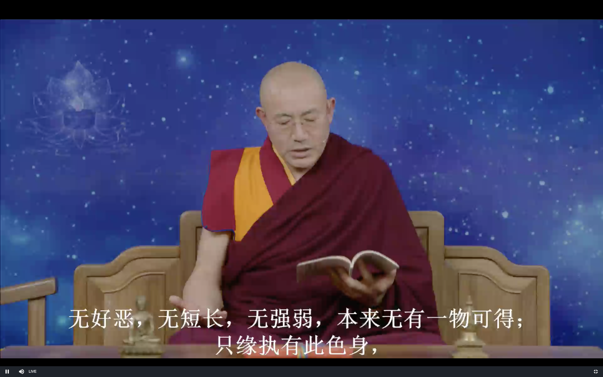

达摩血脉论

上师开示2019 11/22

# 达摩血脉论

### 发菩提心

大圆满里有很多方法可以证悟禅宗 最重要的一个就是修加行 😁

**前佛后佛，只言见性。**

见性 就是证悟空性 证悟自己心的本来面目

解脱的必经之路就是证悟空性 所有的众生虽然根基不一样 但是不能解脱的根本原因就是无明

**诸行无常**

这句话可能不是这里的 但是可以解释 就是因为一切都是无常 所以就要修行

**若不见性，妄言：“我得阿耨菩提”此是大罪人。**

没有证悟 而说自己证悟了 让更多的人跟着他学 走错路 这个是特别严重的

平时呢就不能说自己证悟了 原因就是这个

大圆满 大手印修行方法中也是有这样的境界

如果自己有些境界的话 如果自己说出去 就会停滞不前 不能讲

如果没有的话 就是大妄语

直接不讲 间接的透露出去 也不行 这样子都是有目的的

**十大弟子，阿难多闻中得第一，于佛无识，只学多闻，二乘外道皆无识佛，识数修证，堕在因果中。**

佛陀讲的法 阿难尊者基本上都听过了 是多闻第一

但是阿难尊者是没有证悟 小乘佛教人无我的证悟

佛圆寂的第二年的夏天 五百多个阿罗汉就聚在一起要结集经文

迦叶尊者就给他十大罪名 冤枉他 阿难尊者就特别难过 努力去修行 就证得了阿罗汉

所有有时候痛苦并不是都是坏事 有时候也是修行的动力

小乘的有部中讲 六个比丘 抱团 天天在佛陀面前惹各种各样的麻烦

有个人一直也是不证悟 贪财贪色 结果惹了麻烦 惹到了国王的王宫里 国王的王后出来就要教训他一下

说跟你一起的修行人都证悟阿罗汉了 你还是这个样子 结果这个修行人就特别惭愧 然后就回去精进修行 证得了阿罗汉

所以有时候痛苦不一定是坏事

这个地方的 **于佛无识** 指的是佛的法身 虽然阿难尊者跟佛的化身一直在一起 但是就是不了解佛的法身

不了解 不认识 心中的佛

**二乘外道皆无识佛**

二乘 就是声闻缘觉

或者说小乘 和大乘的一部分的人(心外觅佛的) 都不认识自己心中的法身佛

**识数修证，堕在因果中**

反复的修证 只知道努力的修行 不知道 "烦恼即菩提 众生即是佛" 这些观点

认为佛是外来的 从禅宗 大圆满 大手印的角度来说 这个观点是错误的

修行努力精进 未来成佛 这就是因果 因果就是有为法 无常的 世俗的 这个见解是不对的

**是众生业报，不免生死，远背佛意，即是谤佛众生，杀却无罪过。**

这个还是停留在善恶因果的层面上 

这个是不是小乘佛教 不能证悟阿罗汉呢 不是的

阿罗汉还会不会堕轮回呢 不会的 这个细节问题怎么去理解呢

生死有两种 一种是六道众生的 因为造业而轮回 这个叫做粗大的生死

另外一个叫做细微的生死 从一地到十地菩萨之间 都有

十二缘起支 从无明到死亡 这种生死 这是因为业力 到了一地之后就没有了

一地菩萨以后 因为慈悲心 而不是业力 轮回 这种生死是细微的生死 这种生死在十一地 就是成佛后就会结束

阿罗汉可以灭十二缘起中的粗大的生死 但是后面的细微的生死 阿罗汉是没有办法去灭的

远背佛意 就是违背了佛的最高级的观点 众生就是佛的观点 不修也是佛的观点

本质上现在就是佛 那不修行 不证悟 那本质上也没有用

就像睡觉的人会做梦 虽然梦本质上不存在 但这个也没有用 还是会因为幻觉 梦境而执着痛苦

这种人都是诽谤佛的众生

那佛也是因果的范畴 那不就是无常了吗 这不就是谤佛吗

这种人杀掉也没有罪过 (上师笑)

不能真的这样理解可以杀阿罗汉

这个地方就是说把错误的观点认为是正确的 把佛理解为因果的无常的 这个错误是非常严重的

严重性就是把他杀掉也不过分 也没有罪过 这个地方就是强调错误的严重性 而不是真的

**经云：“阐提人不生信心，杀却无罪过。”若有信心，此人是佛位人。**

阐提人 就是断了善根的人 就像有些人为了自己的感受 不顾杀盗淫妄 非常疯狂的人 这种人叫做阐提人

达摩祖师就是从佛经里找到了这样一个理论依据😁

这种阐提人 杀了也没有罪过 是指的是这种罪过的严重性

也可以这样理解

商人乘船到印度尼西亚 菲律宾等地去取宝 如果成功的话就一生的生活问题就解决了

但是在那个时候 因为天气 航行的原因成功率是很低的

有一次在500个人去取宝 回来的路上 有一个人就打算把这500个人都杀掉

另外一个人就知道了 他就把这个人杀掉了 否则的话这500个人就被杀掉了 这个杀人的人也会堕地狱

而自己杀人的话就只有自己堕地狱 所以他就把这个人杀掉了

这件事情当中 这个人(大悲商主)因为是完全为别人考虑 所以就不仅没有堕地狱 而且是圆满了很多的福德资粮

这里这样理解 这种非常疯狂的阐提人 会发动战争 造很大的恶业 所以把他杀掉也是为了众生 (为了世界和平😁) 也是没有罪过的

第一个理解相对比较合理

佛经有了义和不了义

不了义呢就是在特定的时候为了度某些众生 所以会说不了义

**若有信心，此人是佛位人**

如果有信心的话 这个人很快就会成佛

**若不见性，即不用取次谤他良善，自赚无益。善恶历然，因果分明。**

如果没有证悟的话 就不要随便的诽谤善良的人 证悟了以后才有资格说别人境界的高低

否则的是有罪过的

善恶历然  就是因果不虚 因果分明 结果是清清楚楚的

世俗当中就要遵守因果规律

**天堂地狱，只在眼前，愚人不信，现堕黑暗地狱中；亦不觉不知，只缘业重故，所以不信。**

念佛念的好的人 极乐世界就在他的眼前

杀盗淫妄的人 虽然现在活得好好的 但是 地狱也就在他的眼前

这里看出来达摩祖师 禅宗也是取舍因果 虽然不是特别强调

就像大学里不会特别去强调小学的课程 虽然不特别去讲 但不会去否定的

禅宗强调的就是顶尖的顿教法门

虽然在证悟的境界中没有因果 但是并不代表在我们感官的世界里没有因果

就像我们的现实生活和梦中的生活一样 一点不矛盾的 

**譬如无目人，不信道有光明，纵向伊说亦不信，只缘盲故，凭何辨得日光？愚人亦复如是。**

就像没有眼睛的人 跟他讲也是没用

现今堕畜生杂类，诞在贫穷下贱，求生不得，求死不得。虽受是苦，直问著，亦言：“我今快乐，不异天堂。”

**故知一切众生，生处为乐，亦不觉不知。如斯恶人，只缘业障重故，所以不能发信心者，不自由他也。**

在不知不觉中 生命就结束了

这样的恶人 因为业障重 所以在轮回中受苦

若见自心是佛，不在剃除须发，白衣亦是佛。若不见性，剃除须发，亦是外道。

佛陀时代 大部分在家人的衣服就是白色的

白衣就是代表居士

### 证悟的标准

到底什么是证悟呢 坛经里有一个段落也讲过了

**知心是空** **名为见佛 (开悟)**

知有两种 第一种是通过

自己静下心来 往里观察自己的心 感受自己

感受到自己的心完全是空性 

当自己有情绪 这个时候去观照的话

不仅情绪会消失 而且会看到自己情绪的本质都是如如不动的

出离心 菩提心 有标准自己可以观察

证悟是要问问上师的 不过按照上面的要求 也是可以自己判断自己是不是开悟的

愤怒跟欲望带来的感受是不一样的

傲慢 等等情绪都是一样的 都是意识的感受

(心无有心 则曰本净)

**问曰：“白衣有妻子，淫欲不除，凭何得成佛？”答曰：“只言见性，不言淫欲。只为不见性；**

只要有见性 所有的都不是问题了

淫欲的本性也是佛的智慧 愤怒的本性也是佛的智慧 所有的烦恼都是

平静的本性也是智慧

密法里有很多方法证悟

**但得见性，淫欲本来空寂，不假断除，亦不乐著，纵有余习，不能为害。**

证悟它(淫欲)的本性才有用 它本来是空性是没有用的

阿罗汉是断掉烦恼 才能证悟

大乘呢 除了断掉 还有转换

三转法轮 除了这些之外 不用断除 又不转变 认识到了烦恼的本性 烦恼就不是烦恼了 

证悟的时候就会有这样的感受

不假断除后面可以加一个 不假转换

**何以故？性本清净故。虽处在五蕴色身中，其性本来清净，染污不得。**

五蕴最后一个就是识 识 心的本性就是清净

**法身本来无受，无饥无渴，无寒热，无病，无恩爱，无眷属，无苦乐，无好恶，无短长，无强弱，本来无有一物可得；只缘执有此色身，**

因为对物质构成的色身有我执 所以就产生了一系列的烦恼

**因即有饥渴、寒热、瘴病等相，若不执，即一任作为。**

证悟以后不会造杀盗淫妄的恶业 假使造了的话 也...

**若于生死中得大自在，转一切法，与圣人神通自在无碍，无处不安。**

这个自在无碍 不是说有神通

心中的执著 分别念都断掉了 则无处不安

**若心有疑，决定透一切境界不过。不作最好，作了不免轮回生死。**

如果还有疑惑 看不透一切境界的本质 还是有执著f 那最好不要做任何违背因果的事情 不要遭罪 作了免不了堕入生死轮回

法心实验

最后的密乘戒 就是法心实验 安住在这样的境界中

佛是为了保护我们的善根

不做最好 是一定不能做的意思

### 问答

证悟以后在死亡的时候可以安住在证悟的境界 不用在意外在的阿弥陀佛等形象

奶牛最好让它们自然死亡

一地菩萨道十地菩萨 还是要一步一步的完成

偷盗戒是跟生活有关系的

阿赖耶识虽然是刹那无常 但是会传递给下一个刹那 不会中断 会带入下一世

证悟和入根本慧定

认为有一个不可思议的我的存在 这也是一种执着

对空性的执著也是无药可救 办法是有的 相对就是难一点

就像生病的时候吃药中毒了

有一点点执著 就跟外道就没有区别了 并不是真实存在 这个就是要自己去真实的证悟

看文武百尊的图片 是不是解脱就很容易了吗

中阴的时候 认出来还不够 要安住 修生起次第 当然认出来也是很好的

===================================================

若见性，旃陀罗亦得成佛。”

问曰：“旃陀罗杀生作业，如何得成佛？”答曰：“只言见性，不言作业。纵作业不同，一切业拘他不得。从无始旷大劫来，只为不见性，堕地狱中，所以作业，轮回生死。从悟得本性，终不作业。若不见性，念佛免报不得，非论杀生命。若见性，疑心顿除，杀生命亦不奈他何。”

自西天二十七祖，只是递传心印。吾今来此土，唯传顿教大乘，即心是佛，不言戒、施、精进、苦行；乃至入水火，登剑轮，一食卯斋，长坐不卧，尽是外道有为法。若识得施为运动灵觉之性，即诸佛心。前佛后佛只言传心，更无别法。若识此法，凡夫一字不识亦是佛。若不识自己灵觉之性，假使身破如微尘，觅佛终不得也。

佛者亦名法身，亦名本心，此心无形相，无因果，无筋骨，犹如虚空，取不得。不同质碍，不同外道。此心除如来一人能会，其余众生迷，人不明了。此心不离四大色身中，若离此心，即无能运动；是身无知，如草木瓦砾。身是无情，因何运动？若自心动，乃至语言、施为运动，见闻觉知，皆是心动。心动用动，动即其用。动外无心，心外无动。动不是心，心不是动。动本无心，心本无动。动不离心，心不离动。动无心离，心无动离，动是心用，用是心动。动即心用，用即心动。不动不用。用体本空，空本无动，动用同心，心本无动。故经云：“动而无所动，终日去来而未曾去，终日见而未曾见，终日笑而未曾笑，终日闻而未曾闻，终日知而未曾知，终日喜而未曾喜，终日行而未曾行，终日住而未曾住。”故经云：“言语道断，心行处灭；见闻觉知，本自圆寂。”乃至瞋喜痛痒何异木人，只缘推寻痛痒不可得。故经云：“恶业即得苦报，善业即有善报，不但瞋堕地狱，喜即生天。”若知瞋喜性空，但不执，即诸业脱。若不见性，讲经决无凭，说亦无尽。略标邪正如是，不及一二也。

 

**颂曰：**

心心心，难可寻，宽时遍法界，窄也不容针。

我本求心不求佛，了知三界空无物；

若欲求佛但求心，只这心心心是佛。

我本求心心自持，求心不得待心知；

佛性不从心外得，心生便是罪生时。

 

**偈曰：**

**吾本来此土 传法救迷情**

**一华开五叶 结果自然成**

 达摩大师血脉论终