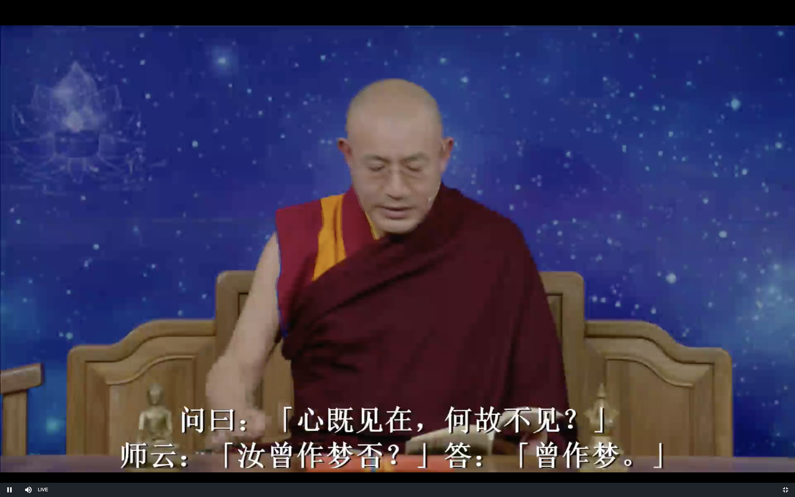
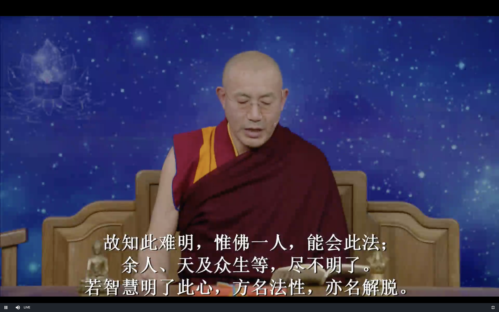

达摩血脉论

上师开示2019 11/06

# 发菩提心

# 达摩祖师血脉论

### 闻思修

佛法的闻思永远不会浪费 很深奥的法义以后一定会成熟

但是修行也很重要

### 上一节课的回顾

#### 见解不能堕两边 两个极端 佛教里讲中观

空性 和 佛性 (胜义谛) / 善恶因果 (世俗谛)

胜义谛里面没有善恶因果 但是我们还没有证悟 大圆满 大手印 禅宗 我们不能不重视因果

佛的境界中不存在因果 但我们众生的境界中 就像梦境中 因果是现实存在的

#### 行为上不能拨无因果

莲花生大师讲 见解比虚空高 取舍因果比粉末还要微细

#### 修行

无作不是禅修 比如说发呆 冬眠 这些都不是禅修

虽然没有念头 但是有潜在的执著 深藏在禅定/冬眠之中 所以不能超越轮回

福报足够大 就是后世会投生色界无色界 否则的话就是动物界 

无作只是禅修的一个基础 最后一定要突破

落到无记空

问曰:既若施为运动，一切时中皆是本心;色身无常之时，
 云何不见本心?

所有的行为 本心这里是佛性 有的时候指的还不是佛性 而是指意识

如果死亡的时候 心的本性不就应该显现吗

比如一盏灯放在一个壶里 那壶砸碎的时候应该可以见到光

师曰, 是你自己看不见本性

答曰:本心常现前，汝自不见? 问曰:心既见在，何故不见?
师曰:汝曾作梦否?
答:曾作梦。

问曰:汝作梦之时，是汝本身否?
答:是本身。

比方做梦打球 梦里就认为我的身体就在打球 不会认为我还有一个身体

又问:汝言语施为运动与汝别不别? 答曰:不别。

打球时候 说的话 运动是不是别人 回答说 不是别人 不是两个人 就是自己

 **师曰:既若不别，即此身是汝本法身;即此法身是汝本心。** 

佛性从来都没有离开过 你没有看到是自己没有看到

就像做梦打球 真正的身体是不是躺在床上 但是做梦打球的时候 你自己是体会不到的

这里佛性好比是真正的躺在床上的身体 而平时各种各样的情绪 就像梦中的人 

那躺在床上的身体和梦中打球的身体 "别不别"呢? 不别, 就是一个啊

烦恼和佛性 "别不别"呢? 不别, 是同一个

"此身" 指的是躺在床上的身体 好比就是你的法身

因为无明 虽然法身存在 但是看不见

**此心从无始旷大劫来，与如今不别;**

佛性 法身 无始以来一直存在 没有生灭

不生不灭 不增不减 不垢不净

**未曾有生死，不生不灭。 不增不减，不垢不净，不好不恶，不来不去;亦无是非、亦 无男女相、**

生死 增减等等都是在世俗谛层面上

胜义谛 佛性 法身 层面上都是不存在的

现在这些还都是理论 但我们要证悟 体会

理论还是会动摇的 证悟之后就不会再动摇了

证悟之后的用途 有大和小两方面

大的就是解脱 就像黑暗的屋子里有一盏灯 灯亮了 黑暗就不在了

小的就是生活中的烦恼 压力 失恋 离婚 公司破产 等等等等 

证悟了心的本性 就会给我们带来绝对的快乐 脱离轮回 大乘佛教的目标 就是让所有众生都解脱

**亦无僧俗老少、无圣无凡;亦无佛、亦无众生、 亦无修证、**

**亦无因果、亦无筋力、亦无相貌;**

因果是错觉 是无明的产物 佛的境界中就是没有因果 而不用说因果存在 因果的本质不存在

**犹如虚空，取不得、舍不得、山河石壁不能为碍; 出没往来，自在神通; 透五蕴山，渡生死河;**

证悟的境界 标准 就是 "犹如虚空"

体会到心的本性 

1. 不是逻辑推理

2. 不是书本上的知识 不是因为是佛说的 龙树菩萨说的 这些不是属于自己的见解

   

初步的证悟 会不那么执著 不会太累 情绪上的波动

证悟是往里看 不是往外看 是简单化 不是复杂化

证悟之后的训练方法 梦瑜伽 这是藏传佛教无上密法

修行就是体会 体悟 活生生的人的经验 就是去体会心的本质

**一切业拘此法身不得。此心微妙难见，**

 **此心不同色心，此心是人皆欲得见。**

此心 这里指的是佛性

**于此光明中运手动足者， 如恒河沙，及乎问著，总道不得，犹如木人相似，总是自己 受用，因何不识?**

凡夫人在世俗方面的 像爱因斯坦这样的人 也就像木头人一样 不知道 也说不出来

心的本性 每天自己都在用 却不认识

**佛言一切众生，尽是迷人，因此作业，堕 生死河，欲出还没，只为不见性。**

不知道心的本性 因此造业 

众生若不迷，因何问著其 中事，无有一人得会者，自家运手动足因何不识。

故知圣人 语不错，迷人自不会晓。

**故知此难明，惟佛一人能会此法; 余人天及众生等，尽不明了。**

若智慧明了，此心号名法性， 亦名解脱。

**生死不拘，一切法拘它不得，(不能影响) 是名大自在王如来;** 

亦名不思议，亦名圣体，亦名长生不死，亦名大仙。名虽不 同，体即是一。

都是证悟

圣人种种分别，皆不离自心。心量广大，应 用无穷，应眼见色，应耳闻声，应鼻嗅香，应舌知味，乃至 施为运动，皆是自心。一切时中但有语言，即是自心。故云 如来色无尽，智慧亦复然。色无尽是自心，心识善能分别一 切，乃至施为运用，皆是智慧。心无形相，智慧亦无尽。故 云如来色无尽，智慧亦复然。四大色身，即是烦恼，色身即 有生灭，法身常住而无所住，如来法身常不变异，故经云: 众生应知，佛性本自有之。迦叶只是悟得本性，本性即是心， 心即是性，性即此同诸佛心。前佛后佛只传此心，除此心外，
  无佛可得。颠倒众生不知自心是佛，向外驰求，终日忙忙; 念佛礼佛，佛在何处?不应作如是等见，但知自心，心外更 无别佛。经云:凡所有相，皆是虚妄。又云:所在之处，即 为有佛，自心是佛，不应将佛礼佛;但是有佛及菩萨相貌，

 忽尔见前，切不用礼敬。我心空寂，本无如是相貌，若取相 即是魔，尽落邪道。若是幻从心起，即不用礼。礼者不智， 智者不礼，礼被魔摄。恐学人不知，故作是辨。诸佛如来本 性体上，都无如是相貌，切须在意。但有异境界切不用采括， 亦莫生怕怖，不要疑惑，我心本来清净，何处有如许相貌。 乃至天龙夜叉鬼神帝释梵王等相，亦不用心生敬重，亦莫怕 惧;我心本来空寂，一切相貌皆是妄见，但莫取相。若起佛 见法见，及佛菩萨等相貌，而生敬重，自堕众生位中。若欲 直会，但莫取一切相即得，更无别语。故经云:凡所有相， 皆是虚妄。都无定实，幻无定相。是无常法，但不取相，合 它圣意。故经云:离一切相，即名诸佛。
问曰:因何不得礼佛菩萨等?
答曰:天魔波旬阿修罗示见神通，皆作得菩萨相貌。种种变 化，是外道，总不是佛。佛是自心，莫错礼拜。佛是西国语， 此土云觉性。觉者灵觉，应机接物，扬眉瞬目，运手动足， 皆是自己灵觉之性。性即是心，心即是佛，佛即是道，道即
    是禅。禅之一字，非凡圣所测。
又云:见本性为禅。若不见性，即非禅也。假使说得千经万 论，若不见本性，只是凡夫，非是佛法。至道幽深，不可话

 会，典教凭何所及。但见本性，一字不识亦得。见性即是佛， 圣体本来清净，无有杂秽。所有言说，皆是圣人从心起用。 用体本来空，名言犹不及，十二部经凭何得及。道本圆成， 不用修证。道非声色，微妙难见。如人饮水，冷暖自知，不 可向人说也。唯有如来能知，余人天等类，都不觉知。凡夫 智不及，所以有执相。不了自心本来空寂，妄执相及一切法 即堕外道。若知诸法从心生，不应有执，执即不知。若见本 性，十二部经总是闲文字。千经万论只是明心，言下契会， 教将何用?至理绝言;教是语词，实不是道。道本无言，言 说是妄。若夜梦见楼阁宫殿象马之属，及树木丛林池亭如是 等相;不得起一念乐著，尽是托生之处，切须在意。临终之 时，不得取相，即得除障。疑心瞥起，即魔摄。法身本来清 净无受，只缘迷故，不觉不知，因兹故妄受报。所以有乐著， 不得自在。只今若悟得本来身心，即不染习。若从圣入凡， 示见种种杂类，自为众生，故圣人逆顺皆得自在，一切业拘 它不得。圣成久有大威德，一切品类业，被它圣人转，天堂 地狱无奈何它。凡夫神识昏昧，不同圣人，内外明彻。若有 疑即不作，作即流浪生死，后悔无相救处。贫穷困苦皆从妄
    想生，若了是心，递相劝勉，但无作而作，即入如来知见。 初发心人，神识总不定;若梦中频见异境，辄不用疑，皆是 自心起故，不从外来。梦若见光明出现，过于日轮，即余习 顿尽，法界性见。若有此事，即是成道之因。唯自知，不可

 向人说。或静园林中行住坐卧，眼见光明，或大或小，莫与 人说，亦不得取，亦是自性光明。或夜静暗中行住坐卧，眼 睹光明，与昼无异，不得怪，并是自心欲明显。或夜梦中见 星月分明，亦自心诸缘欲息，亦不得向人说。梦若昏昏，犹 如阴暗中行，亦是自心烦恼障重，亦自知。若见本性，不用 读经念佛，广学多知无益，神识转昏。设教只为标心;若识
 心，何用看教?若从凡入圣，即须息业养神，随分过日。若 多嗔恚，令性转与道相违，自赚无益。圣人于生死中，自在 出没，隐显不定，一切业拘它不得。圣人破邪魔，一切众生 但见本性，余习顿灭。神识不昧，须是直下便会，只在如今。 欲真会道，莫执一切法;息业养神，余习亦尽。自然明白， 不假用功。外道不会佛意，用功最多;违背圣意，终日驱驱 念佛转经，昏于神性，不免轮回，佛是闲人，何用驱驱广求 名利，后时何用?但不见性人，读经念佛，长学精进;六时 行道，长坐不卧;广学多闻，以为佛法。此等众生，尽是谤 佛法人。前佛后佛，只言见性。诸行无常，若不见性，妄言 我得阿耨菩提，此是大罪人。十大弟子阿难多闻中得第一， 于佛无识只学多闻，二乘外道皆无识佛，识数修证，堕在因
  果中。是众生业报，不免生死，远背佛意，即是谤佛众生， 杀却无罪过。经云:阐提人不生信心，杀欲无罪过。若有信 心，此人是佛位人。若不见性，即不用取次谤它良善，自赚 无益。善恶历然，因果分明。天堂地狱只在眼前，愚人不信，

 现堕黑暗地狱中;亦不觉不知，只缘业重故，所以不信。譬 如无目人，不信道有光明，纵向伊说亦不信，只缘盲故，凭 何辨得日光;愚人亦复如是。现今堕畜生杂类，诞在贫穷下 贱，求生不得，求死不得。虽受是苦，直问著亦言我今快乐， 不异天堂。故知一切众生，生处为乐，亦不觉不知。如斯恶 人，只缘业障重故，所以不能发信心者，不自由它也。若见 自心是佛，不在剃除须发，白衣亦是佛。若不见性，剃除须 发，亦是外道。
问曰:白衣有妻子，淫欲不除，凭何得成佛? 答曰:只言见性，不言淫欲。只为不见性;但得见性，淫欲 本来空寂，自尔断除，亦不乐著，纵有余习，不能为害。何 以故?性本清净故。虽处在五蕴色身中，其性本来清净，染 污不得。法身本来无受，无饥无渴，无寒热，无病，无恩爱， 无眷属，无苦乐，无好恶，无短长，无强弱，本来无有一物 可得;只缘执有此色身，因即有饥渴寒热瘴病等相，若不执， 即一任作。若于生死中得自在，转一切法，与圣人神通自在 无碍，无处不安。若心有疑，决定透一切境界不过。不作最
  好，作了不免轮回生死。若见性，旃陀罗亦得成佛。 问曰:旃陀罗杀生作业，如何得成佛?

 答曰:只言见性不言作业。纵作业不同，一切业拘不得。从 无始旷大劫来，只为不见性，堕地狱中，所以作业轮回生死。 从悟得本性，终不作业。若不见性，念佛免报不得，非论杀 生命。若见性疑心顿除，杀生命亦不奈它何。
自西天二十七祖，只是递传心印。吾今来此土，唯传顿 教大乘，即心是佛，不言持戒精进苦行。乃至入水火，登于
 剑轮，一食长坐不卧，尽是外道有为法。若识得施为运动灵 觉之性，汝即诸佛心。前佛后佛只言传心，更无别法。若识 此法，凡夫一字不识亦是佛。若不识自己灵觉之性，假使身 破如微尘，觅佛终不得也。
佛者亦名法身，亦名本心，此心无形相，无因果，无筋 骨，犹如虚空，取不得。不同质碍，不同外道。此心除如来 一人能会，其余众生迷人不明了。此心不离四大色身中，若 离是心，即无能运动。是身无知，如草木瓦砾。身是无性， 因何运动。若自心动，乃至语言施为运动，见闻觉知，皆是 动心动用。动是心动，动即其用。动用外无心，心外无动。 动不是心，心不是动。动本无心，心本无动。动不离心，心 不离动。动无心离，心无动离，动是心用，用是心动。动即
 心用，用即心动。不动不用，用体本空。空本无动，动用同 心，心本无动。故经云:动而无所动，终日去来而未曾去， 终日见而未曾见，终日[口*笑]而未曾[口*笑]，终日闻而未 曾闻，终日知而未曾知，终日喜而未曾喜，终日行而未曾行，

终日住而未曾住。故经云:言语道断，心行处灭，见闻觉知， 本自圆寂。乃至嗔喜痛痒何异木人，只缘推寻痛痒不可得。 故经云:恶业即得苦报，善业即有善报，不但嗔堕地狱，喜 即生天。若知嗔喜性空，但不执即业脱。若不见性，讲经决 无凭，说亦无尽。略标邪正如是，不及一二也。
颂曰: 心心心难可寻，宽时遍法界，窄也不容针。 我本求心不求佛，了知三界空无物。 若欲求佛但求心，只这心这心是佛。 我本求心心自持，求心不得待心知。 佛性不从心外得，心生便是罪生时。
偈曰:
吾本来此土。 传法救迷情。一华开五叶。 结果自然成。
达摩大师血脉论终