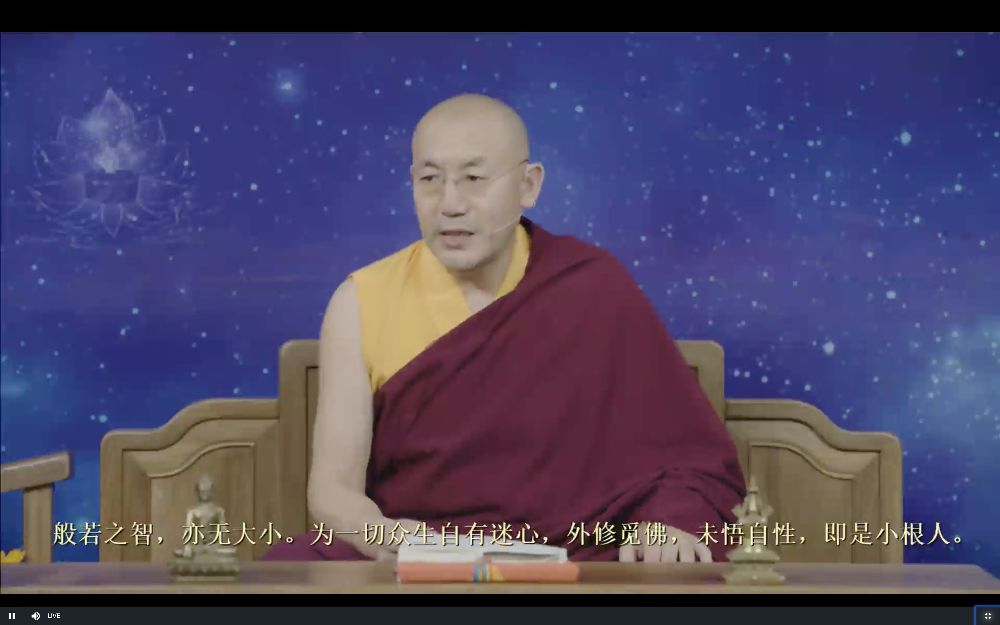
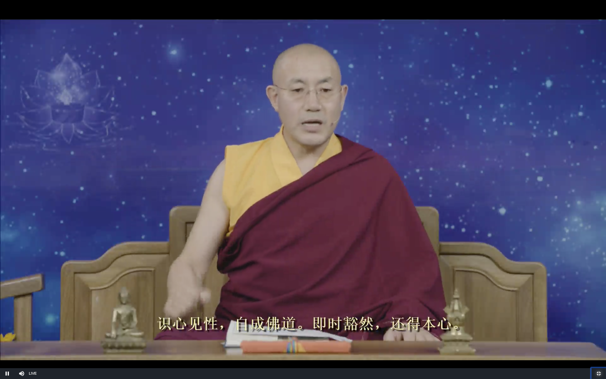

# 坛经 

9月16日上师开示

今天继续讲下半部分 (坛经智慧品)

敦煌版本也有好几种 

**般若之智，亦無大小，為一切眾生自有迷心，外修覓佛，未悟自性，即是小根人。**

>般若之智，亦無大小

就是我们的佛性 我们的本性

佛性有很多名称 佛母 空性 光明 如来藏 般若/也就是智慧

根基有大小 表面形式有大小 内在的佛性无大小

> 外修覓佛 未悟自性，即是小根人

因为一切众生 心中有无明 迷 就是无明 无知 愚昧 

西方极乐世界/东方琉璃世界 都是在一个离我们很遥远的地方

唯识宗/中观 都不认我我们本身就是佛 佛讲的佛性就是空性 我们内心当中没有佛的智慧

我们通过修行把内心中的烦恼全部铲除 有一天可以往生西方极乐世界 但现在我们是众生 不是佛

只有因果关系 佛在外面 不在内心

这个不包含三转法轮 如来藏的部分 大藏经里讲如来藏的佛经只有十几到二十几本

其他的大部分讲空性 不强调如来藏

三转法轮就分为初级的 中级 高级的 佛经就认为我们的心就是智慧

密法里面就讲的非常清楚 方法也是非常的多 灌顶/生起次第等等

大乘佛教 包含显宗,密宗, 二转法轮/自空中观, 三转法轮/他空中观 也分为大根基和小根基

外修觅佛 就是迷信, 就是小根基的大乘修行人

中论 入中论 等等这些都是小根基的(大乘修行人)

**聞其頓教，不信外修，但於自心令自本性常起正見，煩惱塵勞眾生，當時盡悟，**

大根基的人 不往外求 往内心中寻求佛的果位 在自己的内心中 寻找证悟的正见 证悟了内在本性的正见

正见就是认为自己的本性是佛

所有的烦恼尘劳众生 最后一定会全部悟到自己心的本性  佛不在外面 就在自己的心中

最终所有的众生都会成佛 包括动物 昆虫 蚂蚁 蚯蚓等生命 都会成佛

- 因为所有有情众生都有佛性 这是成佛的一个重要条件

- 佛性会不会成熟呢? 一定会成熟的 只是时间早晚的问题 因为世界上有无数的佛 菩萨 日日夜夜奋斗 让一切众生的佛性早日成熟 所以最终这些生命的佛性一定会成熟的 一定会成佛 就是这两个原因

三乘 九乘都是阶段性的

**猶如大海納於眾流，小水大水合為一體，即是見性。**

小水 小根基 大水 大根基的 最后都会回归到大海里 合为一体 这就是看到心的本性

**內外不住，來去自由，能除執心，通達無礙。**

我们的心不会执著内在的 自己的和其他人的执著 对外在世界的执著 从源头上 根本上铲除了 从根本上就不存在了

内心就自由了 

内心不自由 就是因为我们内心的欲望 导致了痛苦 愤怒

内心自由之后 不执著了 即使关在监狱里面 他的内心也是自由的 这是"来去自由"

有烦恼 即使有财富 权力 也感受不到真正的自由

能断除所有的执著 通达了自己心的本性

这时候是什么样的感觉呢? 如果我们清楚的看到了自己的意识 心 是一个如幻如梦的

就像一个电影 讲中阴身的 中阴身去开门但是根本就抓不到

还有就是濒死经验 灵魂出窍

精神意识可以从肉体分离出来的 这时候就叫做"意身" 

这个时候"意身"的"手"去抓门的话 也是不起作用的

如果我们看到我们心的本性 证悟以后 这时候 我们所有的情绪 因为没有办法执著 就是像中阴身的手 或灵魂出窍的身体没法推开门一样 我们的心如梦如幻 就没办法抓住 这就是"内外不住"

平时我们有没有明显的情绪的时候 但这不叫作 "内外不住" 

当我们看到了心虚幻的本质以后 它立即就变成了濒死经验的人的身体一样 对现实生活中的事物就不起任何作用 不会产生烦恼 欲望 愤怒 所有就是 "通达无碍 来去自由''

这都是完全可以感受到的经验 这就是它的原理

根本没有外面的东西进入我们的内心当中 而是我们内心去抓住外面的东西(执著)

到了密法的阶段 外在的东西他根本不关心的

而中观就是要把外面的事物 通过各种各样的方法去观察 抉择为空性 原来外面的世界都是不存在的

而大乘佛教的窍诀就是关注自己的内心 解决了内心 外面的就是内心世界的投影 也就不存在障碍了

**心修此行，即與《般若波羅蜜經》本無差別。**

如果我们的心的境界达到了 "內外不住，來去自由，能除執心，通達無礙" 这就是《般若波羅蜜經》经里讲的没有差别了

开始学习的时候是通过佛经来理解 当我们证悟以后呢 这时候可以反过来用自己的境界来解读佛经 解读整个世界

就是禅宗不需要文字 文字最终的作用就是帮我们理解 而自己有这个境界以后 证悟了以后 就不需要文字了

## 证悟需要上师/善知识

但昨天讲的 "**无念 无忆 无著**" 就是修行中禅定的误区 像六祖慧能都需要上师 **我们就更需要上师了** 用我们自己的能力是很难的 上师就可以帮我们区分 "无念 无忆 无著" 的误区

当然修行还是自己要努力  上师的加持是很重要 但是也要我们有信心 

上师当然是要开悟的上师

解释佛经里的内容 大学里面研究佛经的老师也可以

四加行 五加行 上师瑜伽 就是特别特别的重要

证悟是特别的简单 但这个时候 学习啊 磕头啊 念咒啊 都没有办法了 所以如果没法证悟的的就是很无奈

如果四加行 五加行的基础做得好 对法王如意宝的信心很强 因缘都具备了 证悟的果就不可能不产生

**一切經書及文字，小大二乘、十二部經。皆因人置。**

这些所有的经书 文字 大小乘 十二部经 八万四千法门 都是为了接引人 根据人的情况 人的根基设计安排的

**因智慧性故，故能建立。若無世人，一切萬法本无不有，故知萬法本從人興。一切經書，因人說有。**

人就可以通过闻思修 有这个能力 有这个智慧 所以佛可以建立十二部经佛法

宗宝版: 若无世人 

敦煌新版: 我若無智人，一切萬法本亦不有，故知萬法本從人興。一切經書，因人說有。

敦煌新版的意思更为接近 内容的前后连接更容易 **如果没有这样有这样有智慧的人 那么佛讲这么多法是没有用的 是不会有的**

由此可见 万法 这里讲的是佛法 

佛陀是人天 六道众生里的导师 但是只有人 天可以听闻佛法而被摄受 所以一般讲是 "人天师"

"故知萬法本從人興 " 所有的佛法就是以人为本 

"一切經書，因人說有" 一切的经书都是为人所说的 佛虽然摄受所有六道众生 但是通过说法是只是为人道的众生

緣在人中，有愚有智，愚為小故，智為大人。問迷人於智者，智人與愚人說法，

**令使愚者悟解心開。迷人若悟心開，與大智人無別。**

愚 就是小根基 智 就是大根基

迷人 就是没有证悟的人 向智者 开悟的人 问问题 

证悟的人给没有证悟的人讲法 

没有证悟的人 也是暂时的 也就会证悟了 也就和开悟的人没有差别了

故知不悟，即佛是眾生；一念若悟，即眾生是佛。故知一切萬法，盡在自身心中，

如果不开悟 虽有佛性 如来藏 那也还是众生

只要有一个念头证悟了 就是佛了(佛的境界) 这个时候还不是真正的佛 还路途遥远 但速度会很快的 都不是问题

八万四千法门的精华 不要到外面去寻找 都在自己的内心深处 

何不從於自心，頓見真如本性。《菩薩戒經》云：「我本源自性清凈。」

既然万法的本性都在内心当中 为什么不去证悟心的本性呢?

维摩诘经的一部分 所有的菩萨戒最终都是离不开法界 

**識心見性，自成佛道。即時豁然，還得本心。**

"識心見性" 这里特别重要 大圆满 禅宗

认识自己心的本性

平时我们不太关心自己内心的状况 但开始修禅定 会知道一点点 但这都是心表面的现象 这不是"识心"

真正的"识心"是要感受到心的本质 而不是表面的心的情绪 我们平时24小时接触到的是心的"外衣" 我们要识别的是心的本质 

"识心" 和 "见性" 是一个意思

"自成佛道" 这个时候虽然还没有成佛 但是我们就接触到了佛的法身 就已经上路了 走上了佛道 (见道)

**善知識！我於忍和尚處，一聞言下大悟，頓見真如本性，是故以教法流行后代，今學道者頓悟菩提，**

六祖慧能 称听法的弟子为 "善知识"

我在五祖那里听闻到教法而证悟 五祖把衣钵传给六祖以后 就叫他往南走

有一个人是为了法 而不是为了衣钵 

慧能大师就给了他一句话 "不思善，不思恶，正与么时，那个是明上座本来面目" 当下的这个就是心的本性

这个人就因为这一句话就证悟了 这个听起来 虽然是"这个时候的那个 那个时候的这个"挺绕口的 但是他就证悟了 还是很厉害的 比六祖可能还要厉害 😁 六祖还是因为听了"金刚经"开悟 

**各自觀心，令自本性頓悟。若不能自悟者，須覓大善知識示道見性。**

自己观心 让自己顿悟自己的本性 如果自己没有办法证悟的话 就是要寻找大善知识来开示佛道 来开悟

**何名大善知識？解最上乘法，直示正路，是大善知識，是大因緣。**

大善知识的两个条件

- 自己已经证悟了 

- 而且能把证悟的境界告诉别人的

证悟里的一个大因缘就是善知识

**所為化道，令得見佛。一切善法，皆因大善知識能發起故。**

所谓教化开导 可以见我们心中的佛 法身佛 我们心中的闻思修 戒定慧 都是来自大善知识 这个跟藏传佛教讲的是一模一样的

**三世諸佛，十二部經，亦在人性中本自具有，不能自悟，須得善知識示道見性。**

三世诸佛 十二部经表达的内容 就是空性都在我们心中  三转法轮中讲的最核心的部分 在我们心中都是本来存在的

如果不能自己证悟 就要找善知识 来开示

**若自悟者，不假外求善知識。若取外求善知識，望得解脫，無有是處。**

如果不懂得真正的善知识 三世诸佛都在内在的心里 通过外求来得到解脱 这是错误的

識自心內善知識，即得解脫。若自心邪迷，妄念顛倒，外善知識即有教授。汝若不得自悟

这个跟密宗讲的世一模一样的 有内在的善知识和外在的善知识

内在的善知识 就是内心的本性 如果

如果内心有邪见 不认为自己的内心有佛性 一直求外善知识 虽然外在的善知识可以给我们开示 但是不能自己开悟的话

**外善知識即有教授。汝若不得自悟, 當起般若觀照，剎那間，妄念俱滅，即是自真正善知識, 一悟即如佛也**

宗宝版: **外善知识虽有教授，救不可得。若起真正般若观照，一刹那间，妄念俱灭。**若识自性，一悟即至佛地。

这里如果按照敦煌版的文字的意思 如果自己不能证悟 后面就是不好联系起来 加上宗宝版的部分可能就比较好理解 (佛经在流通的时候也会有错字等等) 上师说自己的理解最好是这样:

外善知識即有教授。汝若不得自悟 救不可得。若起真正般若观照，刹那间，妄念俱灭, 即是自真正善知識, 

一直往外找 

外善知识虽有教授 仅仅靠外善知识 汝若不得自悟 救不可得

> 當起般若觀照，剎那間，妄念俱滅

如果这个时候有去观照自己的心的本性 那所有妄念的本性就会消失 这个时候的"那个呢" (上师笑😁) 就是开悟 就跟佛一样了 

般若智慧一起来 妄念/执著 就会消失了

证悟了以后 有念头和无念头 都是一回事 都是平等的 都是一样了

所以刹那间 妄念俱灭 不是念头都消失了 这是四禅八定的境界 

这个时候执著消失了 而不是念头都没有用了  但是念头都不会影响我们的修行 反而有越多的念头 越能感觉到念头的本质

比如说我们人有身体 和生命

我们可以看到身体 但是看不到生命

如果念头也有身体 和生命

念头的身体就是情绪

它的生命就是智慧 证悟了以后 每一个念头出来 接触到的就是他的智慧 

阿底峡尊者说 看到一百个念头 就是看到了一百尊法身佛

> 即是自真正善知識, 一悟即如佛也

这就是自己内心真正的善知识 这就跟佛差不多了

# 问答

- 证悟达到什么程度可以解脱

从六道轮回彻底解脱就是要达到佛的境界 一地菩萨也是解脱

有证悟的话 凡是任何一个证悟 一分证悟 就有一分解脱 初步的证悟也是临时性的解脱

- 禅宗和米中的证悟的区别

禅宗不讲即生成佛 禅宗的佛讲的是法身佛 境界高的话就是一地菩萨 

密宗讲即生成佛 无上大圆满才有

空性 光明的讲法部分是一样的 但一些密宗高级的方法 禅宗就是没有的 没有这些方法的就是不太可能即生成佛

- 般若禅定要怎么修

生老病死的痛苦来自于执著 证悟以后就没有执著 也就自然就没有这些痛苦了 

临终的时候修大圆满 也会往生极乐世界 但这个是五方佛的净土 是内在的净土 不是外在的极乐世界

- 每一个念头的背后不是执著吗 为什么是智慧呢

执著的深层次是智慧 本质是智慧 执著还是表面的现象

什么是般若观照 如何起般若观照

般若就是智慧 用念头去观察 是没法看到如来藏的 就像用可见光只能看到物体的表面 用X光才能看到深层次的

如果我们用智慧去观照 就能看到深层次的 般若观照就是这样子

- 打坐的时候不舒服 心慌 怎样调整

开始打坐的时候状态一般是不会很好的 自己可能会比较安静一点 

我们内在的心的变化 和天气的变化是一模一样 一个道理的

早上的时候很容易打坐进入状态 但有时候就很糟糕 可能是运气好的时候就打坐感觉好

就像是天气也不可能是天天都好 继续打坐的话就不会有什么问题

如果是打坐心慌的话 可以换一种方法 先把现在修的法先放一放 本质上不会有大问题的

# 回向

上师如何回向 我亦如是回向