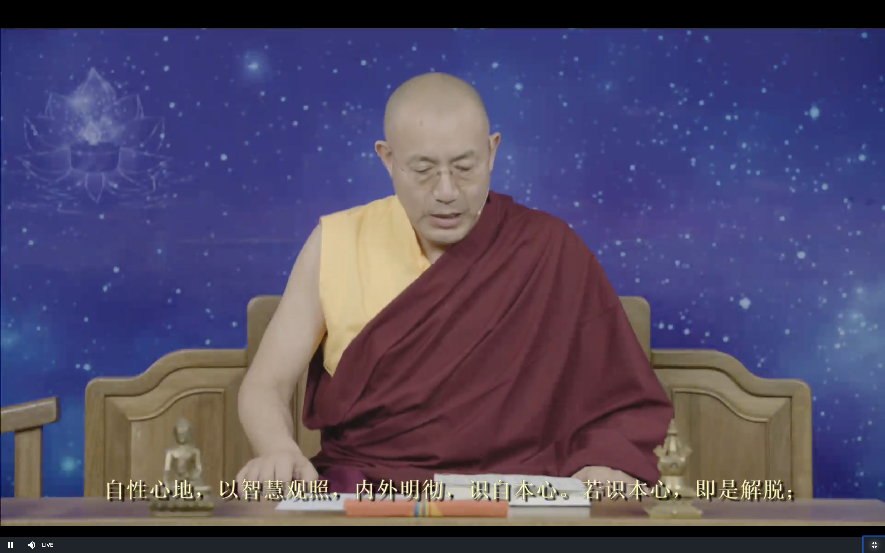
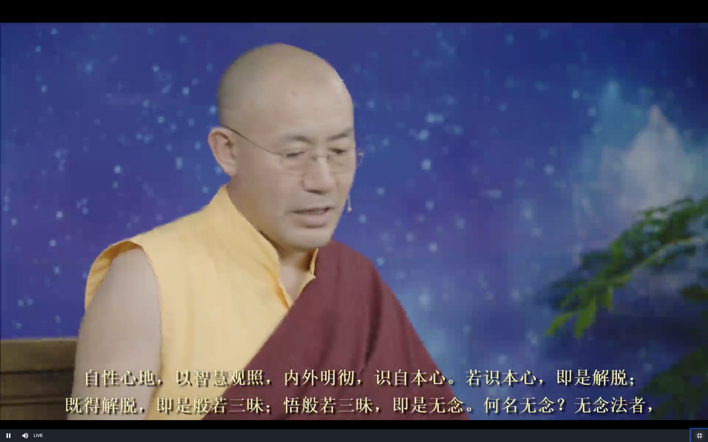
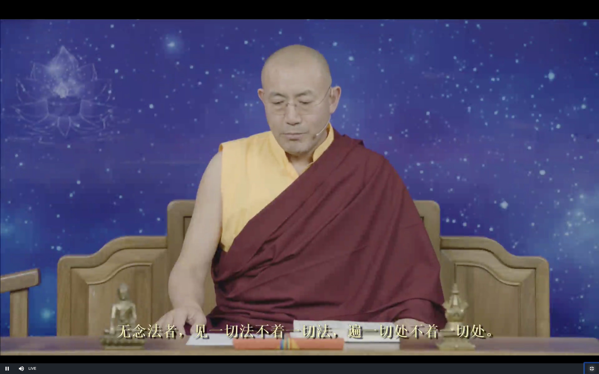
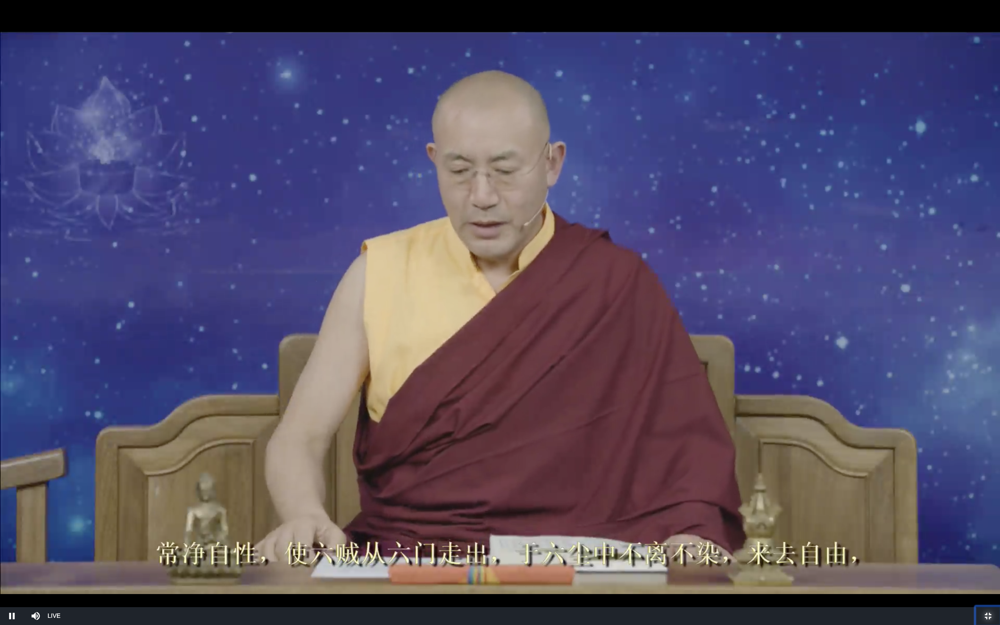
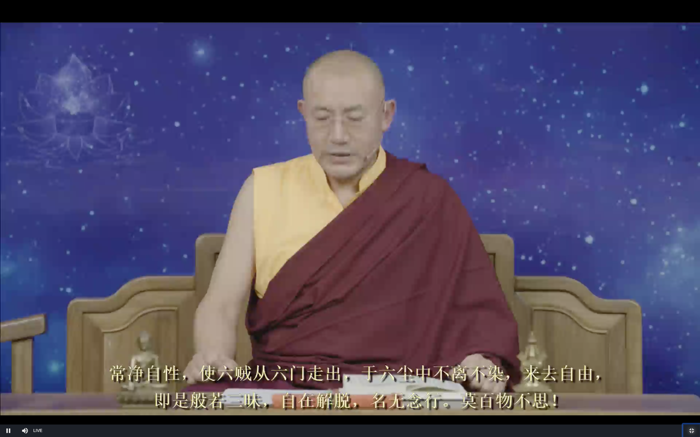
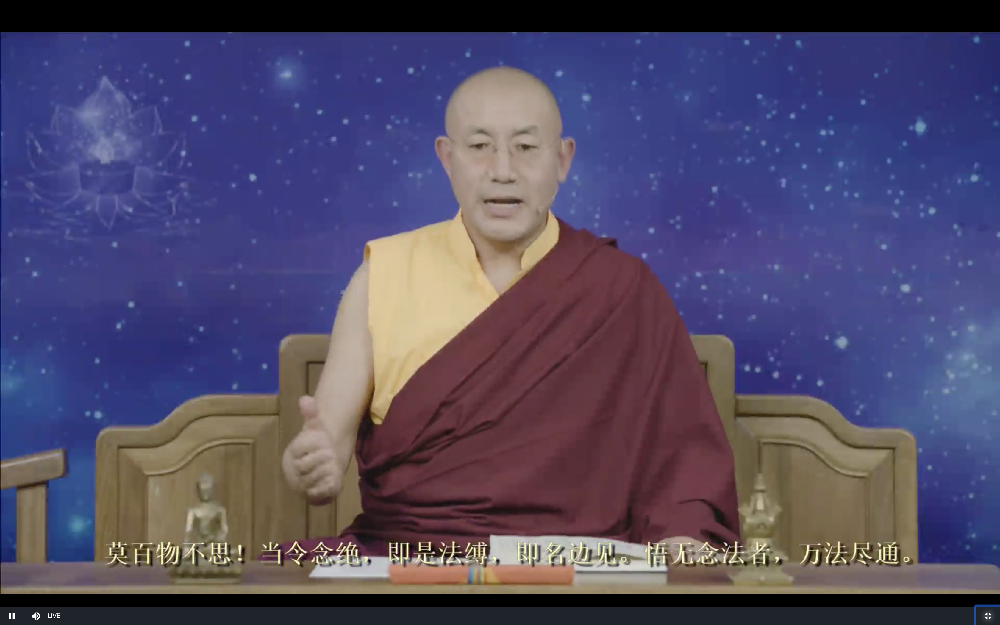
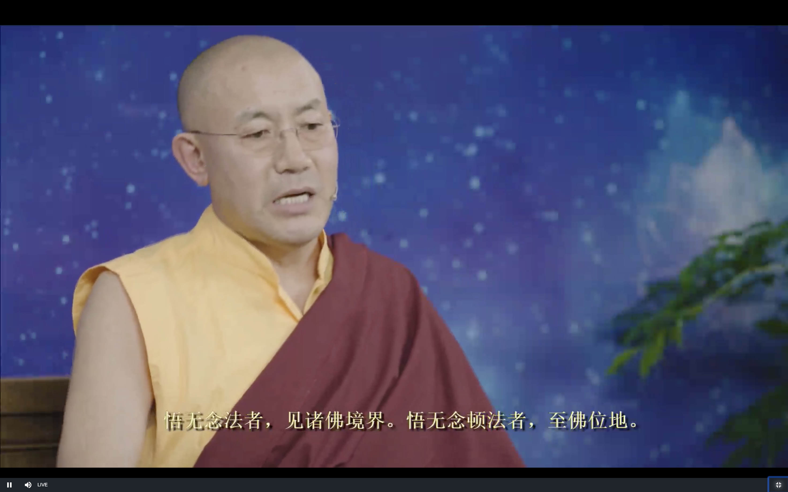
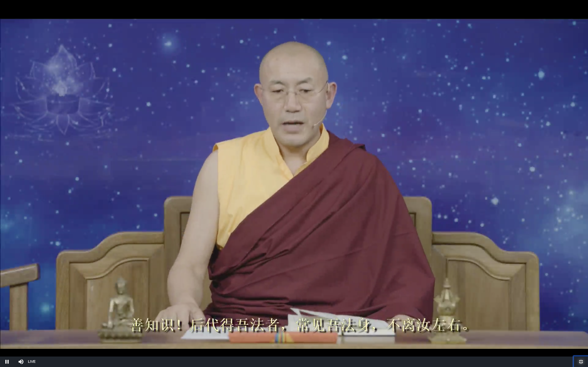
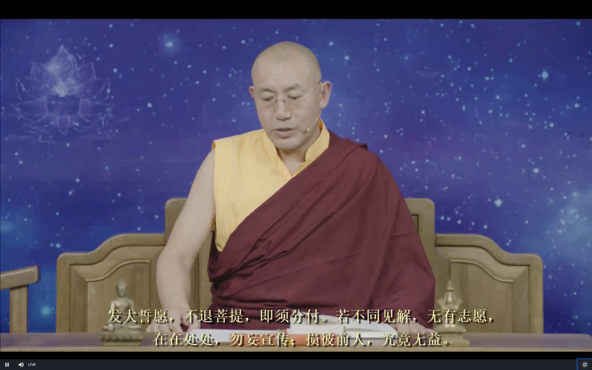
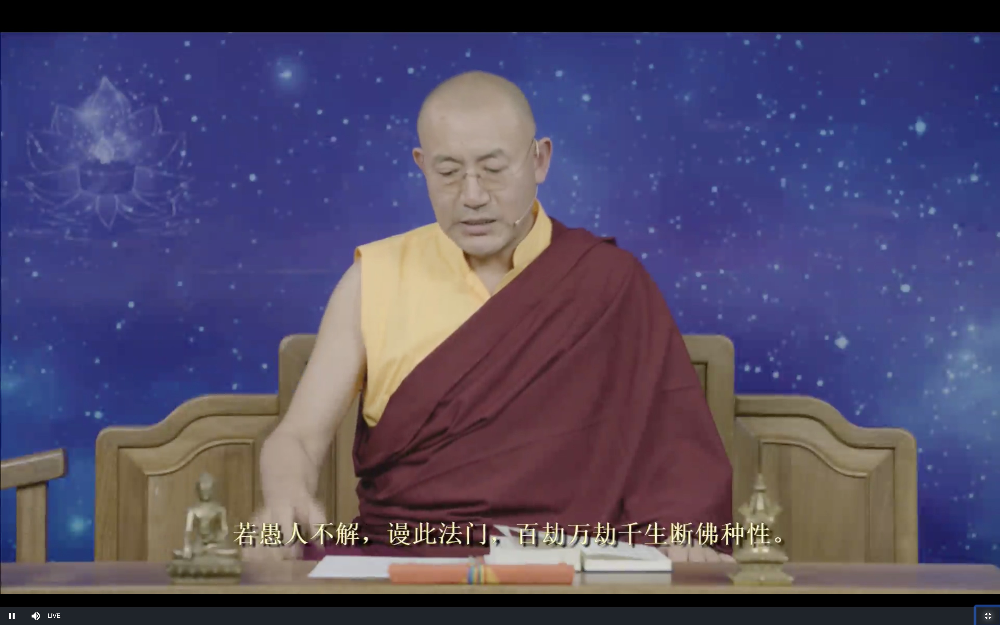

# 坛经 

9月17日上师开示

# 发菩提心

为了让一切众生离苦得乐 我下决心要成佛 今天来学习成佛的方法

今天继续讲坛经 敦煌版的智慧品(按照后来版本的分法)

**自性心地，以智慧觀照，內外明徹，識自本心。若識本心，即是解脫。**

宗宝本有点不一样: 善知识，智慧观照，内外明彻，识自本心。若识本心，即本解脱。

这是自己内心的空性和光明 所以敦煌版说是"自性" 内心的本质 

这不是自己平时的意识去思维判断 不是感官去感觉 这些表面的变化 就是情绪

再深入的就没有办法感觉到了 那就是我们无数的念头贯穿起来 就叫做意识

大乘佛教讲阿赖耶识 小乘佛教就不讲

这个就叫做意识流(阿赖耶识) 这个无数的连贯的念头 就变成了一个系统的东西 就叫做意识流

这每一个念头的背后 最深的地方就是智慧

就像每个人的身体(念头) 和生命(智慧) 的关系一样

一个人24小时的呼吸 大概有26000次 有一部分的呼吸当中 就叫做智慧气

修气脉明点的人 就把26000次当中 提炼出来 打开气脉明点 去证悟

我们不修气脉明点 每天的无数的念头 最深的地方 

假如念头像一棵树 那它们就是树枝 树叶 最下面最深的地方我们看不见的地方 是树根

我们念头表面的是烦恼 情绪 每一个杂念最深处的地方就是智慧

我们就把这个智慧提炼出来 用这个智慧去证悟

具体的方法 密宗有气脉明点的快捷的方法 大圆满根本就不修气脉明点 完全不修气脉明点 有自己的方法去提炼智慧

禅宗的方法 就是坐禅 沉淀杂念 就是智慧逐步显现 就可以证悟

这个时候用这个智慧去感受心的本性

当开悟/证悟之后 还是要去修 我们还是在意识的范畴之内 虽然是用了意识中智慧的部分 还是变化无常的

真正的智慧不是无常的

这个时候我们还是用无常的智慧去感受心的本性

这个还不是一地菩萨的境界 到了一地菩萨的时候 就能够部分的感受到佛性  证悟了一部分

虽然这个时候还是感受 还不是真正的证悟

### 证悟也分广义和狭义

广义的 - 没有到一地菩萨的也算是证悟

狭义的 - 没有到一地菩萨之前的都只能算是感受 还不是证悟 但这种感受跟平时的 烦恼/快乐/无记 是不一样的

实修的时候这些就不重要 意识证悟 或者是智慧证悟 都可以了

### 提炼智慧的方法

就像污水处理 让水静止沉淀 禅宗的 尤其是神秀大师的 就是通过这样的方式去证悟智慧

密法就有很多很多方法 去得到这个智慧

### 关于传承

怎么得到智慧呢? 应该怎么解释呢? 严格意义上讲 如果没有传承的话 或传承断了的话 是没有资格讲的 

但是坛经里讲的跟 大圆满 大手印 是基本一致的 藏传佛教的这些方法上师还是了解的

现在我们讲的是证悟的第一个阶段

比如现在我们是从地球上看月亮 跟从图片上看月亮 还是不一样

初步证悟的状态 就像通过图片看月亮一样 这个跟以前只是听说过月亮 这两个也是不一样

证悟一地之后 就像是直接看月亮

不是通过逻辑推理 出空性 (就像用语言说巧克力 咖啡的味道) 而是通过感觉 体会到了空性 (就像自己亲自品尝到了 巧克力 咖啡) 这就是初级阶段的证悟 

### 智慧关照的结论--初步证悟

四个字 特别重要 "**内外明彻**"

证悟了以后其实没有内外之分 就感觉到了光明 就是空性 又是回到了光明 就是不可思 

就像一个清澈的水一样 比如空中有空气 空气的分子有两个成分构成的 因为都是透明的 我们眼睛是分不出来的

跟虚空是一样的 

无念 无忆 无著 只是透明 清澈 这些形容词都是在形容它(证悟)的一个状态

有几个词汇 禅宗 大圆满 大手印 般若 都在用

"**佛说持人经**" 有八个字 **"心无有心 则曰本净"**

心 表面的现象 各种表面现象 念头 平时让我们快乐痛苦 如果不用智慧观照的话 它让我们做好事 做坏事 

但是去智慧观照的话 心的各种念头 实际上是不存在的 这就是心无有心 第二个"心" 是说这些念头不是真实的

**现而无实有** 有念头的现象 仔细观察的时候 这些念头不是真实存在的 

显宗和密宗的大圆满 基本上用的关键词就是这些了 其他的过程啊等等都不重要了

**证悟是什么呢 不用逻辑 仅仅用感觉 直接感受到了 "心无有心" 就证悟了** **现而无实有**

这个时候意识不是停止 不是间断 这个时候妄念还在继续 所以是还"**现**" 但是已经看见了妄念的生命 深深的体会到 念头是 "现而无实有" 是虚幻的 这个就是初步的证悟

这个时候的证悟 虽然还没有办法从源头 从根本善铲除烦恼的种子(一地菩萨的时候才可以) 但是可以消除一些日常生活中的一些明显的烦恼

这个初步的证悟 对意识范畴中的悲伤 痛苦(还不是身体上的痛苦) 都可以消除

再深入讲的话就是大圆满了 再讲其实也没有什么可以讲的了 就是修四加行 五加行 修上师瑜伽 说的是法王如意宝 还有其他的上师 莲花生大师 释迦牟尼佛

还有就是忏悔业障 积累福报 然后有一天就感觉到 "内外明彻" 就"识自本心"

>  **若识自本心 即是解脱**

原理是什么呢? 平时我们保护自己的利益 权利/权力 财富 当不能满足的时候( **贪** ) 就有抱怨仇恨(**嗔**恨) 嫉**妒** 傲**慢** 攀比 这些都是烦恼 实际上这些都是我们内心自己的问题(无明 愚**痴**) 

佛陀在二转法轮的时候就是通过各种逻辑来推翻自我 而三转法轮就是要建立一个自我

二转法轮是要否定世俗的自我 三转法轮要建立的是内心最深处的本质 光明 清澈 实际上不是第一 第二 第三人称的自我 这些自我是不存在的 这个第三转法轮建立的自我 没有自他 就没有攀比 傲慢 自卑啊等等心态 烦恼都是不存在的

所以说 如果认识到了三转法轮所讲的本心 就是解脱 就没有烦恼 把我们束缚在轮回中的 就是我们自己的烦恼 就解脱了

**既得解脫，即是般若三昧。悟般若三昧，即是無念。何名無念？無念法者，**

证悟了以后 就是进入了般若的禅定 就是无念 

**見一切法，不著一切法；遍一切處，不著一切處。**

> 见一切法 

讲见解 感官还是可以继续感觉这个世界 世界依然存在 没有证悟以前 我们把世界当做是真实的 它会给我们带来幸福快乐(很少) 带来焦虑 压力 不开心(很多) 

证悟了以后 以前给我们带来的压力 焦虑的情况还存在 还能感受到 但是烦恼/痛苦就不会产生了 而且证悟会带来更高级的无漏的快乐 证悟以后不是变成一个木头人那样子的 😛

边缘地区的小孩 可能只能吃到 牛奶/甘蔗 这些甜的 如果不让他吃牛奶/甘蔗 他可能就会焦虑 其实还有很多巧克力 蜂蜜等其他的甜的东西 

证悟以后 现在看一个人 和一年前看一个人(仇人?) 就不一样了 慈悲心就代替了以前的仇恨

证悟了以后 朝九晚五还是要做 但是不会给我们带来压力 痛苦 解脱不是人消失 消失的是我们的烦恼 痛苦 这就是 "若识本性 即是解脱"

内外明彻 明彻这两个字 已经是讲的很清楚了 证悟就是这样子了 文字是有局限性的 要靠自己

>  不著一切法 

不执著一切法

>  遍一切处 

讲见解带来的行为 佛法讲见 修 行 果 这里可以这样解释 不过禅宗也许有不同的解释方法

走到哪里 智慧就在哪里 没有不存在的地方 因为这个时候已经证悟了 所以五个感官

>  不著一切处

一切都不会执著

宗宝本: **般若三昧即是无念。何名无念？若见一切法，心不染着，是为无念。用即遍一切处，亦不着一切处；**

"**用**" 就是把这个见解的应用 就是行为 可以应用到一切地方 生活 工作 等等 虽然是用到一切处 但是一切处都没有执著

**常凈自性，使六賊從六門走出，於六塵中不離不染，來去自由，**

净 就是清净

六贼 就是六识

六门 就是眼根 等六根

六尘 就是色 声 香 味 触 法

眼识通过眼根来看东西 (色尘) 就像贼一样 偷走 夺走我们解脱的慧根

如果没有证悟的话 六贼就会执著六尘 就会染污 意识有执著 主要的执著是来自于意识

证悟以后 就"不离不染" 这个时候眼还是可以看 可以听 这个凡夫的听 和看是不一样的 凡夫是 "不离却染" 证悟以后就 "不离不染"

大圆满里叫做"自解脱" 全知龙钦巴尊者著有三种自解脱 这叫做**六根自解脱** 所以不会造业 没有染污

来去自由 

**即是般若三昧，自在解脫，名無念行。莫百物不思，**

证悟以后看到的世界 跟我们看到的世界 就不一样了

同时去参加娱乐活动 比方说看电影 没有证悟的人 不仅仅是对现实生活执著 而且对电影里的都执著

而证悟的人 不仅对电影里的内容没有执著 而且现实生活也像电影一样 不会执著 虽然他们看到的是一样的东西 不会带来烦恼

名无念行

这就是"无念"的行为 这个时候 证悟的人不是因为执著 而是对其他人负责 因为其他人还是有执著 为了其他人的生存 自己的生存 要去工作 不是因为这些是真实的 而去追求

一地菩萨以下的是因为业力而转世 一地菩萨和以上的是因为慈悲愿力来度众生

### 两个无念禅定的区别 - 百物不思和万法尽通

下面的特别重要 还有后面的"定慧品"也提到了 大圆满里也是一个非常重要的问题

 **莫百物不思 當令念絕，即是法縛，即名邊見。悟無念法者，萬法盡通**

什么都不想 **百物不思** 是不是就是证悟了呢 不是

如果认为这是般若智慧 这个是开悟 这是"法缚" 会把我们束缚在轮回中 会投生到 **色界**和**无色界**

会在很长时间中 几万年 几百万年 进入没有杂念的禅定 但是最后死亡的时候 所有的杂念都恢复了

上师都有些担心 平时有些寺庙有些都打禅七 打禅七当中 如果有把这些平静的状态当做证悟 这个是非常严重的问题

暂时不证悟是没有关系的 但是错误的理解证悟 一辈子当中从这个当中出不来 就是会把我们束缚在轮回当中

法缚 是不是一个错误的见解呢 不是这么简单 而是 几万年 几百万年 这个当中没有任何思维 没有机会修出离心 菩提心 可能是这个阶段没有明显的烦恼 

**"边"** 就是极端 堕落的意思

边 有四边 常见 断见 非常非断 既常既断 这个地方是断见

慧能大师这里说的非常周到 禅宗 大圆满的修法里 对实修的修行人来说 这个是一个非常重要的难题

这种错误的无念的寂止 所有的念头断绝 停止 是个无底洞 智慧品里已经讲过两次了 一定要特别注意

这中寂止的禅定 外道也是有的 这个跟禅宗的禅定是不一样的 

>  **悟無念法者，萬法盡通**

**禅宗的无念 是 万法皆通** 有可能是平静 

有些药物也可以暂时性的影响我们的精神 可以让我们兴奋 或平静 出现各种幻觉 错觉 

但是这些物质/药物的作用消失以后 一切就又都恢复了 作为走解脱道的人来说 这些要注意

悟無念法者，見諸佛境界；悟無念頓法者，至佛位地。

证悟了的 就已经见到了法身佛 很快就会达到佛的地位

**万法皆通** 是证悟了万事万物的本质 不是所有的表面现象 并不是数理化都精通了

**善知識！后代得吾法者，常見吾法身不離汝左右。**

后面的修行无念禅定的修行者 以后会得到慧能大师的法身 其实也是我们自己的法身 其实就是见到了十方三世诸佛菩萨的法身 没有分别 都是大平等

**善知識！將此頓教法門，同見同行，發願受持，如是佛教。終身受持而不退者，欲入聖位，然須傳受。從上已來，嘿然而付衣法**

能够接受顿教法门的同修 应发愿受持 因为这个法殊胜 可以直接看到佛的法身

终身修行 证悟入一地

从上面的 达摩祖师 五祖 以来 禅宗都是默然 心传心 不立文字 遇到根基合适的人的时候

**發大誓願，不退菩提，即須分付。若不同見解，無有志願，在在處處，勿妄宣傳。損彼前人，究竟無益。**

对能发修行的大誓愿的人 根据他的情况 根基来讲法传授

如果对禅宗的法不认同的 没有志愿 会损坏他 对他也没有好处

**若愚人不解，謗此法門，百劫萬劫千生，斷佛種性。**

如果他根基不合适 不能接受 而且会毁谤这个法门 成千上万生 会断绝他的佛的法缘

密宗也是一样 为什么要保密 

如果同见 同行 就可以讲 否则就不能讲

保密不是不能讲 是因为不但不能帮助这些人 而且会断了他们的善根 

保密是为了保护他们的善根和法缘 因为小根基的人 他们的善根是非常脆弱的 是要特别需要保护的 所以要保密

下等根基的人 不能一开始就给他们讲深奥的法

**-- 以上 --**

### 禅宗和大圆满

讲完了 "坛经" 智慧品 的内容 这是整个"坛经"的最主要的精华

这里面主要讲的是见解 怎么修 没有讲 虽然后面几品有讲 但是也不多

因为六祖慧能是利根 直接顿悟 这就是方法 不需要别的方法

但是普通根基的人 可能就适合神秀大师的 渐悟 

大圆满核心的部分也是顿悟 但是也考虑到了普通根基 像"大圆满前行" 也是大圆满 修前行 就是提高了根基

渐悟 也是需要一个模式化的 这就不是在 "坛经" 里面学 

或者是在(证悟)的禅师那里学 但是上师说也不知道这样的禅师在哪里

那我们现在就是修四加行 五加行 然后灌顶 去修大圆满 或者修慧能大师的顿教法门 其实这也是符合神秀大师的渐门的方法 最后这些都能让我们证悟

但是要即身成佛 虹身成就 就是要修大圆满 

否则的就可以修禅宗的修法 禅宗也有"禅净双修" 或者是"禅密双修" 也是一个很好的方法

禅宗很多时候跟大圆满是没有区别的 证悟的理论讲的很清楚 但是具体的方法 最好是前面加上四加行 五加行

反正今生 一定要证悟 至于是禅宗的方法 大圆满的方法 都可以的 要看个人的信心

# 回向

上师如何回向 我亦如是回向